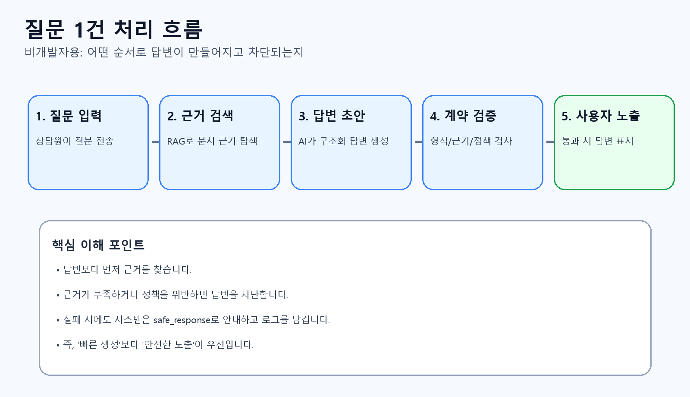
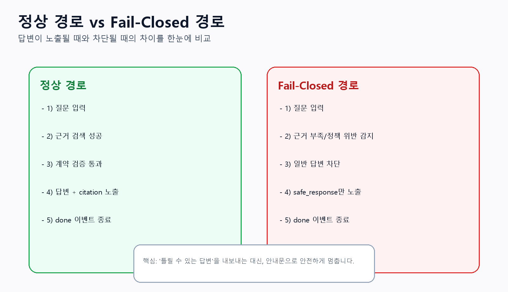
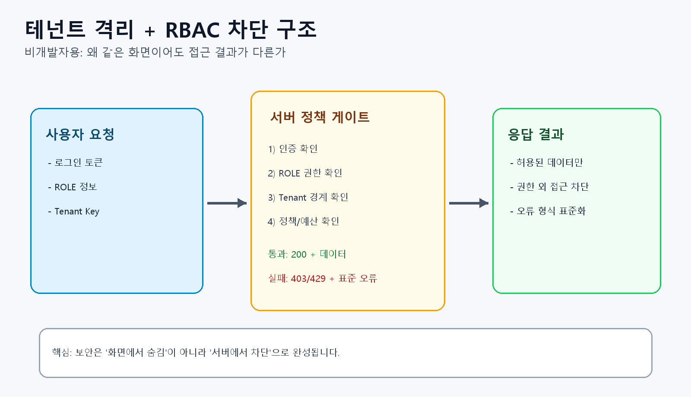
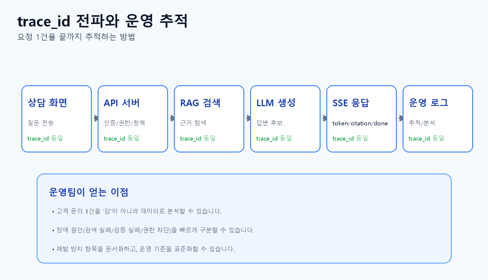

# CS 지원 AI 챗봇 구매자용 상세 해설서 (교재형)

기준일: 2026-02-27 (KST)  
대상 독자: 비개발 구매자, 현업 리더, 운영/보안 담당자, 도입 검토위원회  
문서 성격: "기능 목록"이 아니라, 실제 사용과 운영을 이해하기 위한 학습형 안내서

## 이 문서를 읽는 방법

이 문서는 대학 전공서처럼 "개념 -> 구조 -> 사용법 -> 검증" 순서로 구성되어 있습니다.  
빠르게 훑고 싶다면 1장, 3장, 8장만 먼저 읽어도 핵심 판단이 가능합니다.  
실제 도입 검토를 하려면 4장(기능 심화), 6장(보안/컴플라이언스), 9장(PoC 절차)까지 읽는 것을 권장합니다.

---

## 1장. 제품을 한 문장으로 이해하기

[핵심 요약] 이 제품은 답변 생성보다 답변 통제를 우선하는 운영형 AI 시스템입니다.

이 제품은 "상담원이 AI 답변을 더 많이 받게 하는 시스템"이 아니라,  
"근거가 확인된 답변만 안전하게 내보내는 상담 운영 시스템"입니다.

많은 AI 솔루션은 답변 생성 자체에 집중하지만, 실제 현장에서는 생성 품질보다 통제 품질이 중요합니다.  
왜냐하면 상담 업무는 고객 신뢰, 정책 준수, 법적 리스크와 직접 연결되기 때문입니다.

본 제품은 아래 4가지를 동시에 강제하는 구조를 가지고 있습니다.

- 근거 기반 답변(RAG)
- 계약 기반 검증(Answer Contract)
- 실패 시 안전 응답(Fail-Closed)
- 전 구간 추적(trace_id)

이 네 가지가 동시에 동작해야만 "운영 가능한 AI"가 됩니다.

---

## 2장. 현장에서 실제로 풀어주는 문제

[핵심 요약] 품질 편차, 정책 리스크, 사후 추적 불가라는 3가지 운영 문제를 구조적으로 줄입니다.

## 2.1 상담 품질 편차 문제

상담원 경험치가 다르면 같은 질문에도 답변 품질이 달라집니다.  
특히 제품/환불/배송/약관 문의처럼 규정 중심 질문은, 기억에 의존한 답변이 쉽게 오답으로 이어집니다.

본 제품은 질문마다 근거 문서를 먼저 찾고, 그 근거가 없는 답변은 노출하지 않도록 설계되어 있습니다.  
즉, "상담원 개인 지식"을 보조하면서도, 최종 답변의 기준을 조직의 근거 문서로 맞춥니다.

## 2.2 정책/법무 리스크 문제

근거 없는 답변, 금지 문구 사용, 개인정보 노출은 단건 이슈가 아니라 신뢰 훼손으로 연결됩니다.  
본 제품은 답변 전 단계에서 정책 검사를 수행하고, 실패 시 안전 응답으로 전환합니다.

여기서 중요한 점은 "조용히 틀린 답변을 내지 않는 것"입니다.  
사용자 경험이 잠시 불편해져도, 위험 답변을 차단하는 선택을 기본값으로 둡니다.

## 2.3 사후 추적 불가 문제

"왜 이런 답변이 나왔는가?"를 설명할 수 없으면 운영이 불가능합니다.  
본 제품은 trace_id를 중심으로 요청, 검색, 모델, 스트리밍까지 이어진 흔적을 남깁니다.

운영팀은 한 개의 trace_id만으로 해당 상담 건을 재구성할 수 있어야 하며,  
이 능력이 사고 대응 시간과 품질 개선 속도를 크게 좌우합니다.

---

## 3장. 전체 동작 흐름을 스토리로 이해하기

[한눈에 보기] 로그인 -> 세션 생성 -> 근거 검색 -> 답변 검증 -> 스트리밍 노출 순서로 진행됩니다.

이 장은 실제 상담 1건이 처리되는 과정을 "사용자 눈높이"로 설명합니다.

## 3.1 단계 1: 로그인과 권한 확인

상담원이 로그인하면 시스템은 먼저 "누가 접속했는지"와 "어떤 권한인지"를 확인합니다.  
이때 ROLE taxonomy는 고정입니다.

- AGENT
- CUSTOMER
- ADMIN
- OPS
- SYSTEM

이 고정 분류가 중요한 이유는, 운영 문서/보안 정책/감사 로그가 모두 같은 언어를 써야 하기 때문입니다.

## 3.2 단계 2: 세션 생성과 작업 맥락 준비

세션은 한 건의 상담 대화를 관리하는 단위입니다.  
세션이 생성되면 시스템은 해당 세션에 필요한 기본 컨텍스트를 준비합니다.

- 어떤 테넌트 소속인지
- 어떤 권한으로 동작하는지
- 어떤 예산/제한이 적용되는지

이렇게 해야 질문이 들어올 때마다 "같은 정책 기준"으로 처리할 수 있습니다.

## 3.3 단계 3: 질문 접수와 근거 검색(RAG)

질문이 들어오면 AI가 바로 답을 만들지 않습니다.  
먼저 관련 근거를 찾는 검색 단계가 수행됩니다.

여기서 핵심은 "답변보다 검색이 먼저"라는 순서입니다.  
이 순서를 강제해야 근거 없는 답변 확률을 낮출 수 있습니다.

## 3.4 단계 4: 답변 생성과 계약 검증

AI가 만든 초안은 곧바로 화면에 노출되지 않습니다.  
서버가 다음 조건을 검증합니다.

- 출력 구조가 정해진 형식인지
- citation이 포함되어 있는지
- evidence 점수가 기준 이상인지
- 금지/필수 정책을 위반하지 않았는지

검증을 통과한 경우에만 사용자에게 보여줍니다.

## 3.5 단계 5: 스트리밍 표시와 종료

정상 경로에서는 답변이 스트리밍 이벤트로 전송됩니다.

- token: 답변 텍스트 조각
- citation: 근거 정보
- done: 정상 종료

실패 경로에서는 다음이 전송됩니다.

- safe_response: 안전 안내문
- done: 종료

즉, 실패 상황에서도 "무슨 일이 일어났는지"가 이벤트로 명확히 표현됩니다.

---

## 4장. 기능 체계 심화 해설 (큰 기능 -> 하위 기능 -> 최소 단위)

[핵심 요약] A(상담 실행), B(품질 통제), C(보안), D(운영 신뢰성) 4영역이 함께 동작해야 완전합니다.

이 장은 핵심 기능을 실제 운영 관점으로 상세히 해설합니다.

## 4.1 A영역: 상담 실행 기능

## A1. 상담 시작

### A1-1. 로그인

이 기능은 단순 인증이 아니라, 이후 모든 권한 판단의 기준점을 만드는 단계입니다.  
여기서 잘못 허용되면 이후의 모든 통제가 무력화될 수 있습니다.

### A1-2. 초기 정보 로딩

상담 화면은 로그인 직후 필요한 기준 데이터(권한 범위, 기능 접근 가능 여부 등)를 받습니다.  
이 단계가 안정적이어야 상담원이 "지금 무엇을 할 수 있는지"를 즉시 판단할 수 있습니다.

### A1-3. 세션 생성

세션은 상담 기록의 컨테이너입니다.  
질문/답변/근거/오류 이벤트가 세션 단위로 연결되어야, 나중에 운영 감사가 가능합니다.

## A2. 질의응답 실행

### A2-1. 질문 전송

질문 입력은 보통 단순해 보이지만, 시스템 내부에서는 테넌트, 권한, 예산, 멱등성까지 함께 검사합니다.  
즉, 질문 자체보다 "질문이 들어오는 문맥"이 더 중요합니다.

### A2-2. 스트리밍 수신

사용자는 답변이 점진적으로 표시되는 경험을 얻게 됩니다.  
다만 이 경험은 "빠르게 보이는 것"보다 "검증된 것만 보이는 것"이 우선입니다.

### A2-3. 스트림 이어받기(resume)

네트워크가 흔들리는 환경에서도 상담이 끊기지 않도록 설계된 기능입니다.  
운영 현장에서는 이 기능이 상담원의 체감 안정성을 크게 좌우합니다.

### A2-4. 근거 확인

답변 옆에서 citation/evidence를 확인할 수 있어야, 상담원이 자신 있게 안내할 수 있습니다.  
"왜 이 답이 맞는지"를 상담원이 설명할 수 있게 만드는 기능입니다.

## A3. 상담 종료/이력 관리

### A3-1. 히스토리 확인

상담 이력은 재문의 대응, 품질 평가, 이슈 분석의 기본 자료입니다.  
동일 유형 이슈를 조직적으로 줄이는 데 핵심 역할을 합니다.

### A3-2. 오류/안전응답 확인

safe_response나 오류 코드가 남는 이유는 "문제 은폐"가 아니라 "문제 가시화"입니다.  
이 기록을 통해 운영팀이 개선 우선순위를 정할 수 있습니다.

## 4.2 B영역: 답변 품질 통제 기능

## B1. 근거 검색(RAG)

### B1-1. 질의 해석

사용자의 질문 의도를 검색 가능한 형태로 정리합니다.  
이 단계 품질이 낮으면, 이후 단계가 아무리 좋아도 결과 품질이 흔들립니다.

### B1-2. 문서 근거 검색

정답 생성보다 먼저 근거를 찾아야 합니다.  
이 순서를 놓치면 AI가 "그럴듯한 문장"을 만드는 데 치우칠 수 있습니다.

### B1-3. 상위 근거 선정(top_k)

검색 결과 중 실제로 답변에 쓸 근거를 추립니다.  
너무 좁으면 근거가 부족하고, 너무 넓으면 잡음이 늘어 품질이 떨어집니다.

## B2. 답변 생성

### B2-1. 구조화 답변 생성

결과를 자유 텍스트가 아닌 구조화 형태로 만드는 이유는 검증 가능성을 높이기 위해서입니다.  
검증 가능한 형태여야 품질 게이트를 기계적으로 적용할 수 있습니다.

### B2-2. 인용 메타 포함

citation은 단순 참고 링크가 아니라 신뢰 증거입니다.  
상담원의 답변 책임성과 고객의 수용도를 동시에 높입니다.

## B3. Answer Contract 검증

### B3-1. 형식 검증

정의된 구조와 맞지 않으면 downstream 시스템(화면/로그/분석)이 깨질 수 있습니다.  
형식 검증은 안정성의 첫 관문입니다.

### B3-2. citation 존재 검증

근거가 없는 답변은 본 시스템 정책상 "불완전한 답변"으로 간주됩니다.  
그래서 citation 누락 시 즉시 차단합니다.

### B3-3. evidence 임계치 검증

근거가 있더라도 품질 기준 이하이면 위험 답변일 수 있습니다.  
임계치 검증은 "근거 있음"과 "신뢰 가능함"을 구분하는 장치입니다.

### B3-4. 정책 문구 검증

금지 문구 또는 필수 문구 누락은 컴플라이언스 리스크로 연결됩니다.  
이 기능은 품질보다 정책 준수를 먼저 보장하는 역할을 합니다.

## B4. Fail-Closed 안전 전환

### B4-1. 일반 답변 차단

검증 실패 시 가장 중요한 동작은 "출력을 멈추는 것"입니다.  
대충이라도 답하려는 경향을 원천 차단합니다.

### B4-2. safe_response 제공

사용자에게 시스템 상태를 투명하게 전달하면서도 위험 답변은 막습니다.  
운영적으로는 불편할 수 있지만, 장기적으로는 신뢰를 지키는 선택입니다.

### B4-3. 종료 정합성 유지

실패 상황에서도 이벤트 종료(done)를 명확히 보내야, 화면/로그 상태가 일치합니다.  
이 정합성이 없으면 현장에서는 "멈춤인지 오류인지" 해석이 어려워집니다.

## 4.3 C영역: 보안/컴플라이언스 기능

## C1. 인증/권한(RBAC)

### C1-1. JWT 인증

요청 주체를 식별하는 기본 장치입니다.  
다만 인증만으로는 충분하지 않고, 이후 권한 검증이 반드시 따라야 합니다.

### C1-2. ROLE 검증

ROLE은 기능 접근의 정책 경계입니다.  
표준 분류를 흔들지 않아야 운영 문서와 시스템 행동이 일치합니다.

### C1-3. 미권한 차단(403)

접근 거절은 사용자 불편이 아니라 보안 유지 수단입니다.  
문제는 "왜 거절됐는지"가 설명 가능해야 한다는 점이며, 이때 표준 오류 코드가 중요합니다.

## C2. 테넌트 격리

### C2-1. 테넌트 라우팅

멀티 테넌트 환경에서 가장 중요한 기본기입니다.  
잘못 라우팅되면 데이터 격리 위반으로 바로 이어질 수 있습니다.

### C2-2. 경계 외 접근 차단

같은 시스템을 쓰더라도 고객사별 데이터는 논리적으로 분리되어야 합니다.  
이 경계가 흔들리면 전체 제품 신뢰가 무너집니다.

### C2-3. 캐시/세션 분리

격리는 DB 조회만의 문제가 아닙니다.  
캐시, 세션, 임시 저장 영역까지 분리되어야 실제 누출 위험을 줄일 수 있습니다.

## C3. 개인정보(PII) 통제

### C3-1. 모델 입력 전 마스킹

모델에게 불필요한 개인 정보를 주지 않는 것이 1차 방어입니다.  
입력 단계에서 제거하면 이후 파생 경로 리스크를 줄일 수 있습니다.

### C3-2. 로그 저장 전 마스킹

운영 로그는 오래 남고 접근자가 많기 때문에 저장 전 통제가 필수입니다.  
로그는 디버깅 도구이지, 개인 정보 저장소가 아닙니다.

### C3-3. 응답 노출 시 마스킹

화면 노출 단계에서도 마지막 점검이 필요합니다.  
앞 단계에서 놓친 정보가 최종 출력으로 나가지 않도록 다중 방어를 둡니다.

## 4.4 D영역: 운영 신뢰성 기능

## D1. 추적성(Observability)

### D1-1. trace_id 전파

trace_id는 사건 번호와 같습니다.  
이 값이 끝까지 유지되어야 "원인 분석이 가능한 시스템"이 됩니다.

### D1-2. 전 구간 연결

HTTP 요청, 검색, 모델, 스트리밍 로그를 한 흐름으로 묶어 봐야 의미가 있습니다.  
조각 로그는 많아도 문제 해결 속도는 느릴 수 있습니다.

### D1-3. 사후 분석

장애 대응은 재현과 증빙이 핵심입니다.  
추적 데이터가 충분하면 추측이 아닌 근거 기반 대응이 가능합니다.

## D2. 예산/오남용 방어

### D2-1. 토큰 한도

비용 통제와 서비스 안정성을 동시에 지키는 기본 장치입니다.

### D2-2. tool 호출 한도

과도한 도구 호출은 지연과 비용을 동시에 증가시킵니다.  
한도를 두면 비정상 사용 패턴도 조기 탐지할 수 있습니다.

### D2-3. 세션 누적 예산

단건 제한만으로는 장시간 누적 사용을 통제하기 어렵습니다.  
세션 단위 누적 한도가 있어야 현실적인 관리가 됩니다.

### D2-4. SSE 동시성 한도

스트리밍은 사용자 체감 품질을 높이지만, 동시성 관리가 없으면 서버 부담이 급격히 커집니다.

## D3. 장애 대응

### D3-1. 표준 오류 응답 유지

오류 형식이 통일되어야 모니터링, 알림, 운영자동화가 안정적으로 동작합니다.

### D3-2. 안전 실패 경로

실패 시 "아무 답변이나 내보내는 것"은 단기 회피일 뿐 장기 리스크를 키웁니다.  
본 제품은 실패를 숨기지 않고 안전하게 표현합니다.

### D3-3. Runbook 대응

운영은 사람 기억이 아니라 문서 기반 재현성이 중요합니다.  
Runbook은 "누가 대응해도 같은 결과"를 목표로 합니다.

---

## 5장. 실제 사용자 사용법 (비개발자 실습형)

[실무 팁] 답변 문장만 보지 말고, 항상 citation과 오류 코드까지 함께 확인해야 품질 사고를 줄일 수 있습니다.

## 5.1 첫 사용 전 체크

사용자는 다음을 먼저 확인해야 합니다.

- 본인 계정 권한이 올바른지
- 소속 테넌트가 올바른지
- 데모/운영 환경이 구분되어 있는지

초기 확인을 생략하면 기능 오류로 오해하는 경우가 많습니다.

## 5.2 기본 질의응답 실행 절차

1. 로그인 후 새 세션을 만듭니다.
2. 질문을 입력하고 전송합니다.
3. 답변이 스트리밍으로 표시되는지 확인합니다.
4. 답변과 함께 citation이 보이는지 확인합니다.
5. 필요 시 citation을 열어 근거를 확인합니다.

핵심은 "답변 문장만 읽지 말고 근거 패널까지 확인"하는 습관입니다.

## 5.3 safe_response가 나왔을 때의 실무 처리

safe_response는 시스템 오작동 신호가 아니라 "위험 답변 차단 성공" 신호일 수 있습니다.  
현업에서는 아래 순서로 대응하면 됩니다.

1. 질문을 더 구체적으로 다시 입력
2. 필요한 사실(기간, 대상, 상품군)을 보완
3. 반복 발생 시 운영팀에 trace_id 전달

이렇게 하면 문제를 사용자-운영팀이 공동으로 빠르게 분류할 수 있습니다.

## 5.4 자주 발생하는 사용자 실수

- 근거 확인 없이 답변만 복사해 전달
- 세션/테넌트를 혼동한 상태에서 테스트 수행
- 오류 코드를 캡처하지 않고 "안 된다"만 전달

이 실수를 줄이면 도입 초반 안정화 속도가 매우 빨라집니다.

---

## 6장. 보안/컴플라이언스 해설 (비개발자용)

[주의] 화면에서 기능이 숨겨져도 보안이 되는 것은 아닙니다. 서버 권한 차단(403)까지 확인해야 합니다.

## 6.1 왜 보안은 "기능"이 아니라 "기본 동작"이어야 하나

보안은 옵션으로 켜고 끄는 기능이 아닙니다.  
상담 시스템에서는 기본 경로 자체가 보안 정책을 내장해야 사고를 예방할 수 있습니다.

## 6.2 표준 에러 payload의 의미

본 제품은 오류를 아래 구조로 통일합니다.

- error_code
- message
- trace_id
- details

이 구조가 중요한 이유는 세 가지입니다.

- 사람: 현업이 오류를 이해하고 전달하기 쉬움
- 운영: 자동 분류/알림 체계 구축이 쉬움
- 감사: 사후 검증 시 누락이 적음

## 6.3 권한과 UI의 관계

화면에서 버튼을 숨기는 것은 보안이 아닙니다.  
서버가 요청 자체를 거절해야 실제 보안이 성립합니다.

따라서 "버튼이 안 보인다"보다 "직접 호출해도 403이 난다"가 더 중요한 확인 포인트입니다.

## 6.4 PII 통제의 현실적 의미

개인정보는 시스템에 한번 유입되면 복제 경로가 많아집니다.  
입력, 로그, 캐시, 응답 전 구간에서 반복 통제해야 실제 위험을 줄일 수 있습니다.

---

## 7장. 운영 구조 해설 (왜 추적성과 게이트가 필요한가)

[핵심 요약] trace_id와 품질 게이트가 있어야 장애 대응이 추측이 아닌 근거 기반으로 전환됩니다.

## 7.1 trace_id가 운영 품질을 바꾸는 방식

trace_id가 있으면 현상 설명이 아니라 근거 기반 진단이 가능합니다.  
예: "어제 오후 3시쯤 이상했다"가 아니라 "해당 trace_id 요청에서 evidence 검증 실패"로 설명할 수 있습니다.

## 7.2 품질 게이트의 역할

품질 게이트는 개발팀을 느리게 하려는 절차가 아닙니다.  
잘못된 변경이 운영으로 들어가는 것을 사전에 차단하는 안전장치입니다.

게이트가 통과했다는 것은 "완벽함"이 아니라 "정의된 위험 기준을 넘지 않았다"는 뜻입니다.

## 7.3 안전 실패(Fail-Closed)와 사업 리스크

단기 관점에서는 답변 차단이 불편해 보일 수 있습니다.  
하지만 장기 관점에서는 잘못된 답변 확산을 막아 브랜드/법무 리스크를 줄입니다.

결국 Fail-Closed는 기술 선택이 아니라 경영 리스크 관리 선택입니다.

---

## 8장. 구매자/도입 검토자를 위한 검증 체크리스트

[한눈에 보기] 기능, 보안, 운영 검증을 분리해 체크하면 의사결정 정확도가 올라갑니다.

## 8.1 기능 검증 체크리스트

1. 정상 질의에서 답변 + citation + done이 표시되는가
2. 네트워크 중단 후 resume이 동작하는가
3. safe_response 발생 시 일반 답변이 함께 노출되지 않는가
4. 오류 코드가 표준 구조로 내려오는가

## 8.2 보안 검증 체크리스트

1. 무권한 호출이 서버에서 403으로 차단되는가
2. 테넌트 경계 외 접근이 차단되는가
3. 로그/응답에서 PII 원문이 보이지 않는가
4. ROLE taxonomy가 문서와 시스템에서 일치하는가

## 8.3 운영 검증 체크리스트

1. trace_id로 한 건을 끝까지 추적할 수 있는가
2. 장애 발생 시 Runbook대로 재현 가능한가
3. 예산/동시성 초과가 정책대로 429/403으로 처리되는가
4. 검증 아티팩트가 지속적으로 관리되는가

---

## 9장. 4주 PoC 권장 운영안 (실무형)

[실무 팁] 2주차 기능검증보다 3주차 운영검증에서 실제 도입 성패가 갈리는 경우가 많습니다.

## 1주차: 준비

- 현행 상담 유형 분류
- 정책 문서/근거 문서 정리
- 역할/권한/테넌트 구조 확인

산출물: PoC 범위 정의서, 검증 시나리오 초안

## 2주차: 기능 검증

- 정상/오류/보안 케이스 시연
- safe_response 시나리오 반복 검증
- 현업 피드백 수집

산출물: 케이스별 결과표, 개선 요청 목록

## 3주차: 운영 검증

- trace_id 추적 리허설
- 장애 대응 Runbook 리허설
- 모니터링 지표 점검

산출물: 운영 준비 체크리스트, 잔여 위험 목록

## 4주차: 파일럿

- 제한된 인원으로 실사용
- KPI(응답 품질, 재문의율, 운영 대응시간) 측정
- 본도입 여부 판단

산출물: 파일럿 결과 보고서, 확장 도입 권고안

---

## 10장. 자주 묻는 질문(FAQ)

[한눈에 보기] 본 장은 구매자가 가장 많이 묻는 "왜 막는가, 왜 추적하는가" 질문에 답합니다.

## Q1. 왜 답변을 막는가? 그냥 "비슷한 답변"이라도 주면 안 되나?

상담 도메인에서는 "비슷한 답변"이 오히려 리스크를 키울 수 있습니다.  
정확하지 않은 답변은 재상담, 민원, 법적 분쟁으로 이어질 수 있기 때문입니다.  
그래서 본 제품은 불확실하면 멈추는 설계를 택합니다.

## Q2. 상담원이 AI를 믿고 그대로 복사하면 위험하지 않나?

맞습니다. 그래서 근거 패널과 정책 검증을 함께 제공합니다.  
제품의 목표는 "AI를 맹신하게 만드는 것"이 아니라 "근거 확인 후 사용하게 만드는 것"입니다.

## Q3. 비개발 조직도 운영할 수 있나?

가능합니다. 다만 최소한의 운영 프로세스(trace_id 전달, 오류 코드 기록, PoC 체크리스트)는 필요합니다.  
도구만 도입하고 운영 절차를 생략하면 기대효과가 크게 떨어집니다.

## Q4. 우리 회사 정책에 맞춰 바꿀 수 있나?

가능합니다. 정책 문구, 금지 조건, 권한 정책, UI 표기 방식은 도입 단계에서 맞춤화할 수 있습니다.  
다만 핵심 안전 원칙(Fail-Closed, 표준 에러 구조, 권한 서버 검증)은 유지하는 것을 권장합니다.

---

## 11장. 이 문서의 투명성 범위

[주의] 본 문서는 신뢰성 이해 문서이며, 가격/SLA/법무는 별도 제안서에서 확정됩니다.

이 문서는 구조와 운영 메커니즘을 이해시키는 목적입니다.  
아래 항목은 별도 계약/제안 문서에서 확정해야 합니다.

- 가격/과금 모델
- SLA 수치
- 법무 조항 및 책임 범위
- 고객사별 인프라 구축 옵션

즉, 본 문서는 "기술적/운영적 신뢰성 이해서"이며, 계약서 대체 문서는 아닙니다.

---

## 12장. 참고 근거 문서

- `docs/architecture/NOTION_System_Architecture.md`
- `docs/review/mvp_verification_pack/01_MVP_EXPLAIN_FOR_NON_DEV.md`
- `docs/review/mvp_verification_pack/CURRENT.md`
- `docs/review/mvp_verification_pack/04_TEST_RESULTS.md`
- `docs/review/mvp_verification_pack/artifacts/quality_snapshot_20260227.md`
