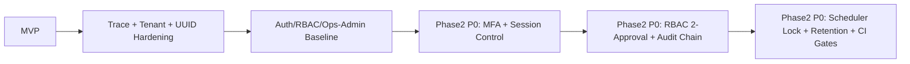

# PROJECT_FULL_IMPLEMENTATION_AND_HARDENING_REPORT_202603XX

- report_version: `2026-02-21`
- report_type: `누적 종합 완료 보고서 (Project-start -> Phase2 P0 보강)`
- baseline_snapshot: `docs/reports/PROJECT_FULL_IMPLEMENTATION_AND_HARDENING_REPORT_20260221.md`
- policy_lock_reference: `docs/review/plans/20260221_auth_rbac_ops_admin_design_and_hardening_plan.md`
- phase2_plan_reference: `docs/review/plans/202603XX_production_readiness_phase2_plan.md`

## A. Executive Summary
- 프로젝트 목적: 고객센터 상담원이 RAG 근거 기반으로 안전하게 답변하고, 운영팀이 인증/권한/감사/지표를 추적 가능한 상태로 운영할 수 있게 하는 것이다.
- MVP -> 운영형 전환 핵심:
  1. 인증을 JWT + refresh rotation/reuse 차단 구조로 고도화.
  2. RBAC를 서버 최종권위로 강제하고 stale permission 토큰 차단(401) 체계를 고정.
  3. Ops/Admin 콘솔(대시보드/감사로그/즉시조치)과 운영 지표 파이프라인을 추가.
  4. Hardening Gate + spec/notion 동기화 + UTF-8 검증 + 증적 파일 체계를 운영 게이트에 편입.
- 현재 상용화 준비 수준 평가: **High (운영 전 점검 가능한 수준)**.
  - backend 전체 테스트 PASS
  - frontend test/build PASS
  - 주요 보안 정책(쿠키/CSRF/lockout/reuse/stale) 코드 반영 완료

## B. 아키텍처 진화 타임라인
| 시점 | 변화 | 근거 |
|---|---|---|
| 초기 | MVP API/세션/메시지/RAG 기본 구조 구축 | `0dd8179` ~ `5379ba3` |
| 2026-02-17~20 | UUID 정합성/테넌트 경계/MyBatis 전환/하이브리드 RAG 고도화 | `1c8b561`, `df783af`, `fb7800a`, `6eb8baa` |
| 2026-02-21 baseline | Auth/RBAC/Ops-Admin 하드닝 + 10개 정책 고정점 도입 | `d0ec39c`, `20260221...hardening_plan.md` |
| 2026-02-21 Phase2 P0 | MFA/세션 대응/2인 승인/감사 해시체인/스케줄러 락/회귀 워크플로우 추가 | 현재 워킹트리 변경분 + V4/V5/V6 |

## C. 보안 고도화 내역
1. 인증 구조 개선 전/후
- Before: 로그인/토큰 중심.
- After: refresh rotation CAS + reuse 탐지(409) + session_family revoke.
- Why: refresh 탈취 재사용 공격을 즉시 차단하기 위해.

2. stale permission 차단
- 정책: `permission_version` 불일치 시 `401 AUTH_STALE_PERMISSION`.
- Why: 권한 변경 직후 구 토큰으로 권한 우회되는 창을 닫기 위해.

3. lockout + rate-limit
- 정책: `rate-limit -> lockout` 우선순위, `AUTH_RATE_LIMITED`/`AUTH_LOCKED` 분리.
- Why: 공격 트래픽 억제와 계정 보호 신호를 분리해 운영 대응 정확도를 높이기 위해.

4. CSRF + Cookie hardening
- refresh cookie path 고정(`/v1/auth`), same-site 기본(Lax), 분리 도메인 전환 정책 고정(None+Secure+Origin allowlist).
- Why: refresh/logout 쿠키 전달 일관성과 CSRF 공격면 최소화를 동시에 달성하기 위해.

5. 감사로그 민감정보 차단 + 해시체인
- 정책: sanitizer 후 payload만 저장/체인 입력, hash_prev/hash_curr/chain_seq 기록.
- Why: 법적/운영 감사에서 위변조 탐지 가능성과 민감정보 보호를 동시에 확보하기 위해.

6. Redis + DB 혼합 운영
- 판정은 Redis(속도), 상태/감사는 DB(정합성).
- Why: 실시간 차단 성능과 영속 감사 추적을 동시에 만족하기 위해.

## D. RBAC 및 권한 모델 설명
- ROLE 고정: `AGENT`, `CUSTOMER`, `ADMIN`, `OPS`, `SYSTEM`.
- `Manager/System Admin`은 ROLE이 아니라 `ADMIN` 내부 `admin_level`로 처리.
- matrix 모델: `resource_key + role_code + admin_level + allowed`.
- stale 처리 흐름:
  1. 토큰의 `permission_version` 확인
  2. DB 현재값과 불일치 시 401(`AUTH_STALE_PERMISSION`)
  3. 프론트 refresh 1회, 실패/반복 시 로그인 이동
- deny audit linkage: 승인/반려/거부 이벤트를 감사로그로 연결.

## E. 운영(Ops) 아키텍처
1. `tb_ops_event` append-only
- 로그인 성공/실패, rate-limit, lockout, refresh reuse, rbac denied, block action 등 이벤트를 append-only로 저장.

2. `tb_api_metric_hourly` 집계
- UTC 버킷 고정, `@Scheduled` 집계, idempotent upsert.
- unique key: `(tenant_id, hour_bucket_utc, metric_key)`.
- allowlist metric_key만 집계.

3. 스케줄러 멀티인스턴스 안전성
- `tb_scheduler_lock` lease lock으로 단일 실행 보장.
- lock miss 시 skip + observability 이벤트 기록.

4. 감사로그 diff/export
- 기존 조회 + diff 기반에 async export job(DB spool)을 추가.
- 신규 경로: create(202) -> status polling -> download.
- export는 OPS만 허용, tenant/date/row/max_bytes/max_duration 제한 적용.
5. 감사 체인 무결성 점검
- `GET /v1/admin/audit-logs/chain-verify`로 최근 범위 hash chain 검증 가능.
- 실패 시 `tb_ops_event`에 `audit_chain_verify_failed` 이벤트를 적재.
6. scheduler self-healing
- `SchedulerLockJanitorJob`이 stale lock을 감지하고 자동 회복 시도.
- 결과는 lock outcome metric(`scheduler_lock_events_total`)과 운영 런북으로 연계.

## F. 데이터베이스 변경 요약 (V1 -> V6)
- V1: MVP 코어 테이블.
- V2: RAG 하이브리드 검색 관련 확장.
- V3: Auth/RBAC/Ops/Admin 하드닝 1차(세션 family, 감사로그, ops_event, metric_hourly, rbac_matrix, block).
- V4: MFA + 세션 가시성 테이블.
- V5: RBAC 2인 승인 + 감사 해시체인 + export 로그.
- V6: scheduler lock + retention + partition plan baseline.

신규/확장 주요 테이블:
- 신규: `tb_user_mfa`, `tb_user_mfa_recovery_code`, `tb_auth_mfa_challenge`, `tb_rbac_change_request`, `tb_rbac_change_approval`, `tb_audit_chain_state`, `tb_audit_export_log`, `tb_scheduler_lock`, `tb_data_retention_policy`, `tb_data_retention_run`, `tb_partition_plan`
- 확장: `tb_auth_session`, `tb_audit_log`

tenant 격리:
- 모든 보안/운영 데이터는 tenant 기반 필터링을 전제로 접근.

## G. API 변경 요약
Auth:
- `POST /v1/auth/login` (MFA 상태 분기 지원)
- `POST /v1/auth/refresh` (CAS rotation/reuse detection)
- `POST /v1/auth/logout`
- `POST /v1/auth/mfa/totp/enroll`
- `POST /v1/auth/mfa/totp/activate`
- `POST /v1/auth/mfa/verify`
- `POST /v1/auth/mfa/recovery-codes/regenerate`
- `GET /v1/auth/sessions`
- `DELETE /v1/auth/sessions/{session_id}`
- `POST /v1/auth/sessions/revoke-others`

Admin/Ops:
- `PUT /v1/admin/rbac/matrix/{resource_key}` (요청 생성으로 전환)
- `GET /v1/admin/rbac/approval-requests`
- `POST /v1/admin/rbac/approval-requests/{request_id}/approve`
- `POST /v1/admin/rbac/approval-requests/{request_id}/reject`
- `GET /v1/admin/audit-logs/export`
- `POST /v1/admin/audit-logs/export-jobs`
- `GET /v1/admin/audit-logs/export-jobs/{job_id}`
- `GET /v1/admin/audit-logs/export-jobs/{job_id}/download`
- `GET /v1/admin/audit-logs/chain-verify`

상태코드/에러 정책:
- 표준 포맷 유지: `error_code`, `message`, `trace_id`, `details`
- 핵심 코드: `AUTH_STALE_PERMISSION(401)`, `AUTH_RATE_LIMITED(429)`, `AUTH_LOCKED(429)`, `AUTH_REFRESH_REUSE_DETECTED(409)`

## H. 테스트 및 검증 결과
실행 명령:
- `cd backend && ./gradlew.bat test --no-daemon`
- `cd frontend && npm ci && npm run test:run && npm run build`
- `python scripts/spec_consistency_check.py`

결과:
- Backend: PASS
  - 증적: `docs/review/mvp_verification_pack/artifacts/phase2_1_backend_test_202603XX.txt`
- Frontend test: PASS
  - 증적: `docs/review/mvp_verification_pack/artifacts/phase2_1_frontend_test_202603XX.txt`
- Frontend build: PASS
  - 증적: `docs/review/mvp_verification_pack/artifacts/phase2_1_frontend_build_202603XX.txt`
- Spec consistency: PASS=9 FAIL=0
  - 증적: `docs/review/mvp_verification_pack/artifacts/phase2_1_pr2_spec_consistency_202603XX.txt`
- UTF-8 strict decode: PASS
  - 증적: `docs/review/mvp_verification_pack/artifacts/phase2_1_utf8_check_202603XX.txt`

추가 관찰:
- `.nvmrc`를 `22`로 고정하고 주요 워크플로우를 `node-version-file: .nvmrc`로 전환했다.
- 로컬 실행 노드 버전 증적: `docs/review/mvp_verification_pack/artifacts/golive_node_version.txt`

## I. 스펙/Notion 동기화 현황
- 변경 스펙 파일:
  - `docs/references/google_ready_api_spec_v0.3_20260216.xlsx`
  - `docs/references/CS_AI_CHATBOT_DB.xlsx`
  - `docs/uiux/CS_RAG_UI_UX_설계서.xlsx`
- 반영 내용:
  - Async export job API 3종 반영
  - DB 스키마(V7/V8) 신규/확장 테이블 반영
  - OPS-002 UIUX 시트 API/테이블 사용 목록 반영
- `spec_sync_report.md` 반영:
  - 섹션 11에 변경 파일/요약/검증 결과 기록
- Notion 동기화:
  - 자동 반영 상태: `BLOCKED (Auth required)`
  - 수동 패치 문서: `docs/review/mvp_verification_pack/artifacts/phase2_1_pr2_notion_manual_sync_patch_202603XX.md`
  - 상태 증적: `docs/review/mvp_verification_pack/artifacts/phase2_1_pr2_notion_sync_status_202603XX.txt`

## J. 현재 리스크 및 Phase2 제안
잔여 리스크:
1. Notion MCP 인증 미연결 환경에서는 자동 동기화가 차단되므로 토큰/권한 운영 자동화를 추가해야 한다.
2. Async export는 DB spool 기준으로 안정화했지만 object storage 전환(Phase2.2) 설계 이행이 남아 있다.
3. WebAuthn 미도입(TOTP 우선 단계).
4. Scheduler self-healing은 구현됐으나, 다중 리전/대규모 운영에서의 자동 알림 연동은 추가 보강이 필요하다.

Phase2.1 제안:
1. WebAuthn(패스키) 병행 도입.
2. ABAC 확장(고객사 정책 기반 세분 권한).
3. 관측 고도화(락 충돌율/승인 지연시간/SLA 경보 대시보드).
4. Async export storage를 object storage로 확장(인터페이스 유지).
5. retention 정책 자동 검증과 백업/복구 런북 연동.

## K. Go-Live Gap Closure (PR-A/PR-B)
PR-A (Spec/Node/CI):
- `.nvmrc=22` 고정, CI 워크플로우 2개를 `node-version-file` 방식으로 전환.
- API 스펙에서 role/access_level 분리 정규화 및 Phase2 누락 API 보강.
- `spec_consistency_check`를 access level 검증 포함으로 확장.

PR-B (Runbook/Audit verifier):
- 운영 runbook 3종 추가:
  - `docs/ops/runbook_scheduler_lock.md`
  - `docs/ops/runbook_audit_chain.md`
  - `docs/ops/runbook_spec_notion_gate.md`
- audit chain 검증 API 추가:
  - `GET /v1/admin/audit-logs/chain-verify`
  - 실패 시 `tb_ops_event(metric_key=audit_chain_verify_failed)` 적재
- verifier 단위 테스트 추가:
  - `backend/src/test/java/com/aichatbot/global/audit/AuditChainVerifierServiceTest.java`

핵심 증적:
- `docs/review/mvp_verification_pack/artifacts/phase2_1_pr1_notion_auth_preflight_202603XX.txt`
- `docs/review/mvp_verification_pack/artifacts/phase2_1_pr1_ci_step_summary_202603XX.txt`
- `docs/review/mvp_verification_pack/artifacts/phase2_1_pr2_export_job_api_202603XX.txt`
- `docs/review/mvp_verification_pack/artifacts/phase2_1_pr2_export_worker_test_202603XX.txt`
- `docs/review/mvp_verification_pack/artifacts/phase2_1_pr3_scheduler_self_heal_202603XX.txt`
- `docs/review/mvp_verification_pack/artifacts/phase2_1_backend_test_202603XX.txt`
- `docs/review/mvp_verification_pack/artifacts/phase2_1_frontend_test_202603XX.txt`
- `docs/review/mvp_verification_pack/artifacts/phase2_1_frontend_build_202603XX.txt`
- `docs/review/mvp_verification_pack/artifacts/phase2_1_utf8_check_202603XX.txt`

## Appendix: dirty baseline 대비 변경 파일 추적
- GoLive 시작 baseline: `docs/review/mvp_verification_pack/artifacts/golive_baseline.patch`
- baseline 대비 추가 변경 파일 목록: `docs/review/mvp_verification_pack/artifacts/golive_dirty_delta.txt`
- 추적 방식: `golive_git_status_start.txt` 대비 현재 변경 파일셋 비교.
- Phase2.1 세션 변경 파일 목록: `docs/review/mvp_verification_pack/artifacts/phase2_1_dirty_delta_202603XX.txt`
