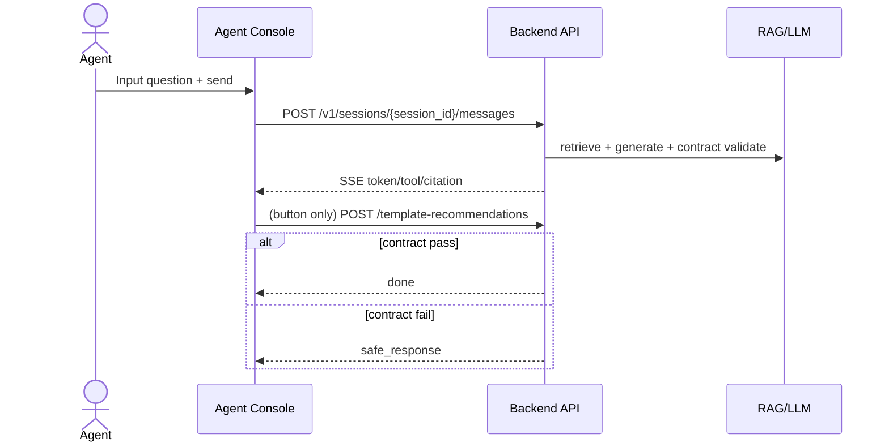
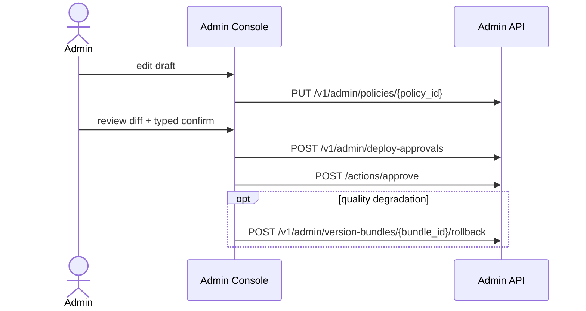
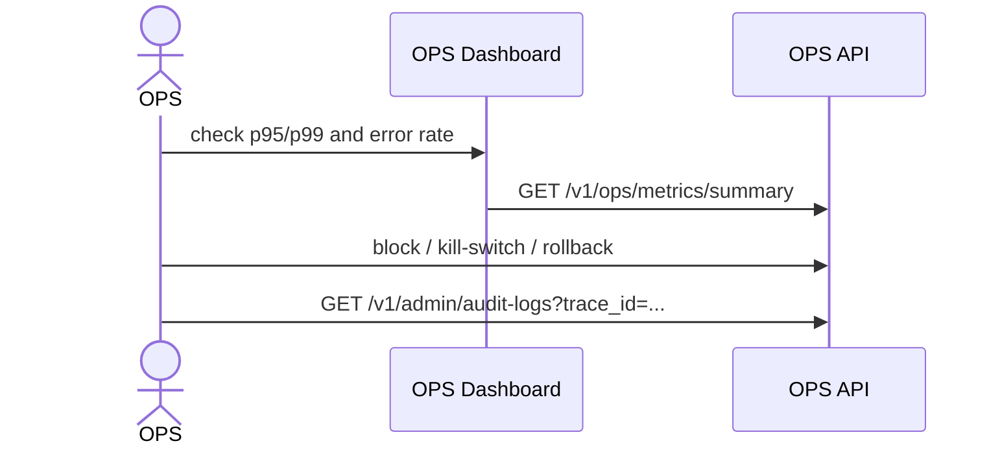

# UI/UX 설계서 (상용화 기준, 재작성본)

## 문서 메타
- Date: 2026-02-17
- Source-of-truth priority: `AGENTS.md` > API workbook > Requirements > Key Features > DB > Development Environment
- Figma reference node: `10301:23060`
- Figma URL: https://www.figma.com/design/niTbDLNhimdROIKSLCDyDI/3-Free-AI-Chatbot-App-UI-Kit--Community-?node-id=10301-23060&t=R1ZERa20S6hHjoii-4

## 제품 목표/비목표
### 목표
1. Help agents draft/review/send evidence-grounded responses quickly.
2. Enforce Fail-Closed, PII masking, trace_id propagation, RBAC, Budget, approved-version flow in UI behavior.
3. Allow operators to drill down end-to-end by a single trace_id.
### 비목표(MVP)
1. Free-text fallback when contract fails.
2. Full parity of customer UI with agent/admin consoles.
3. Full autonomous deployment orchestration.

## 사용자/페르소나
- Agent: speed + policy compliance + evidence verification
- Customer: message + attachment + CSAT/handoff baseline
- OPS Manager: monitoring and emergency controls
- System Admin: approvals and release authority

## 분석 요약(Analysis Summary)
### 1) Requirements Statement.csv
| Metric | Value |
|---|---|
| ReqID count | 54 |
| Domain distribution | ADM:6, AI:11, API:8, INT:3, KB:3, OPS:7, SEC:3, SYS:4, UI:9 |
| Priority distribution | Must:47, Should:7 |

| ReqID | Domain | Scenario | Priority | Difficulty | Tech Stack | Guide Summary |
|---|---|---|---|---|---|---|
| SYS-001 | SYS | 채팅 위젯 진입 → 세션 초기화 | Must | 중 | React, Spring Boot, Redis, PostgreSQL | 기능: 채널 진입 시 세션을 생성/복원한다. 로직/예외: customer_token 또는 anonymous_id 기준으로 활성 세션 조회 후 없으면 생성, 만료 세션은 신규 발급. 입출력: 입력(channel_id, locale, customer_token) / 출력(session_id, expires_... |
| SYS-004 | SYS | 질문 입력 → 로그 저장 | Must | 중 | Spring Boot, OpenTelemetry, Micrometer, OpenSearch/Elasticsearch | 기능: 운영 관측의 단일 기준선으로 Trace/Metric/Log 상관관계를 강제한다. 로직/예외: trace_id/session_id/message_id를 API·AI·INT 전 구간에 전파하고 누락 이벤트는 저장 차단 후 경보를 발생시킨다. 입출력: 입력(request_context, telemetr... |
| UI-002 | UI | 질문 입력 → 멀티턴 대화 | Must | 중 | React, TypeScript | 기능: 멀티턴 입력, 수정, 재전송, 버튼형 답변(quick reply)을 지원한다. 로직/예외: draft/sent/retry 상태머신을 적용하고 quick reply도 동일 전송 검증 파이프라인을 사용한다. 입출력: 입력(text, quick_reply_id) / 출력(outbound_message,... |
| UI-004 | UI | 응답 생성 → 스트리밍 | Must | 중 | React, EventSource/Fetch stream, Nginx SSE, Client Telemetry | 기능: SSE 기반 토큰 스트리밍과 스켈레톤/타이핑 인디케이터를 렌더링한다. 로직/예외: token/chunk/done/error 이벤트를 누적 파싱하고 done 이전 종료 시 자동 복구 플로우를 트리거한다. 입출력: 입력(SSE events) / 출력(incremental assistant messag... |
| UI-006 | UI | 응답 생성 → 오류 노출 | Should | 하 | React, i18n, Error Boundary | 기능: 타임아웃/정책차단/도구실패별 오류 메시지와 재시도 UX를 제공한다. 로직/예외: error_code 카탈로그로 사용자 문구를 결정하고 재시도 가능 오류만 버튼을 노출한다. 입출력: 입력(error_code) / 출력(localized error UI). AC: 1) 오류 유형별 문구 분기 정확 2... |
| SYS-002 | SYS | 채팅 위젯 진입 → 테넌트 라우팅 | Must | 중 | Spring Boot, PostgreSQL, Redis | 기능: host/tenant_key/locale 기반으로 정책 번들과 스킨을 라우팅한다. 로직/예외: 매핑 실패 시 default tenant로 폴백하고 경고 이벤트를 남긴다. 입출력: 입력(host, tenant_key, locale) / 출력(tenant_id, policy_bundle, theme)... |
| UI-003 | UI | 질문 입력 → 첨부파일/이미지 업로드 | Must | 중 | React, File API, Object Storage | 기능: 파일/이미지 첨부, 미리보기, 업로드 상태 표시를 제공한다. 로직/예외: 확장자/용량/MIME 검증 후 presigned URL 업로드를 수행하고 실패 파일만 개별 재시도한다. 입출력: 입력(file metadata, binary) / 출력(attachment_token, preview_url).... |
| SYS-003 | SYS | 질문 입력 → 공통 오류 처리 | Must | 하 | Spring Boot, Problem Details, OpenTelemetry | 기능: 내부 예외를 표준 에러코드와 사용자 메시지로 변환한다. 로직/예외: 도메인 예외는 카탈로그 매핑, 미분류 예외는 GENERIC_ERROR로 수렴한다. 입출력: 입력(exception, trace_id) / 출력(error_code, user_message, http_status). AC: 1) 모... |
| UI-005 | UI | 스트리밍 → 재연결 | Must | 중 | React, SSE retry policy | 기능: 네트워크 단절 시 자동 재연결 및 이어받기를 수행한다. 로직/예외: Last-Event-ID/message_id로 재구독하고 실패 시 요약 재요청 fallback을 실행한다. 입출력: 입력(last_event_id, message_id) / 출력(resumed stream or fallback).... |
| UI-001 | UI | 채팅 위젯 진입 → 히스토리 복원 | Must | 중 | React, TypeScript, Zustand | 기능: 위젯 로딩 시 세션/히스토리를 복원하고 초기 화면을 구성한다. 로직/예외: 스켈레톤을 먼저 보여주고 세션 조회 성공 시 최근 메시지를 렌더, 실패 시 재시도 CTA를 노출한다. 입출력: 입력(session bootstrap) / 출력(message list UI). AC: 1) 초기 TTI 목표 ... |
| UI-007 | UI | 피드백/해결여부 확인 → 상담원 전환 | Must | 중 | React, Spring Boot API, Admin Console | 기능: CSAT/해결여부 수집과 상담원 전환 UX를 제공한다. 로직/예외: 대화 종료 또는 반복 실패 시 피드백 카드를 노출하고 미해결/고객요청/불만 조건이면 handoff CTA를 활성화한다. 입출력: 입력(csat_score, solved_flag, handoff_reason) / 출력(feedbac... |
| API-007 | API | 공통 API 처리 | Must | 중 | Spring Boot, API Gateway, Redis Rate Limiter, Budget Service | 기능: 에러코드 표준화와 rate-limit/quota/idempotency 규약을 공통 적용한다. 로직/예외: 429/Retry-After/X-RateLimit 헤더를 일관 제공하고, 입력/출력 토큰 예산, 툴호출 횟수 예산, 세션 누적 예산, SSE 동시연결 제한을 사용자/테넌트 기준으로 강제한다. ... |
| API-001 | API | 채팅 위젯 진입 → 세션 생성 | Must | 중 | Spring Boot, Redis, PostgreSQL | 기능: POST /v1/sessions로 세션을 생성/복원한다. 로직/예외: client_nonce 중복 요청은 동일 session_id를 반환하고 인증 실패는 401 처리한다. 입출력: 입력(channel_id, locale, customer_token, client_nonce) / 출력(session... |
| API-002 | API | 채팅 위젯 진입 → 세션 조회/종료 | Must | 하 | Spring Boot, JPA | 기능: GET /v1/sessions/{id} 조회와 POST /v1/sessions/{id}/close 종료를 제공한다. 로직/예외: 조회는 커서 기반 페이징, 종료 후 추가 메시지 전송은 409로 차단한다. 입출력: 입력(session_id, cursor) / 출력(session state, mess... |
| API-006 | API | 로그 저장 → 검색 | Should | 중 | Spring Boot, OpenSearch, PostgreSQL | 기능: 대화/도구호출/에러/latency/token 로그 저장 및 검색 API를 제공한다. 로직/예외: 쓰기는 append-only, 조회는 기간/세션/의도/에러코드 필터를 지원하고 과도한 조회는 제한한다. 입출력: 입력(filter query) / 출력(log page, aggregations). AC... |
| API-004 | API | 응답 생성 → 스트리밍 엔드포인트 | Must | 중 | Spring WebFlux, SSE, Nginx | 기능: GET /v1/sessions/{id}/stream SSE 엔드포인트를 제공한다. 로직/예외: event 타입(token/tool/citation/done/error) 표준화, heartbeat 누락 시 재연결 유도, 중단 시 resume token 발급. 입출력: 입력(session_id, me... |
| API-005 | API | 피드백/해결여부 확인 | Must | 하 | Spring Boot, PostgreSQL | 기능: POST /v1/messages/{id}/feedback와 POST /v1/sessions/{id}/csat를 제공한다. 로직/예외: 메시지 평가는 upsert, 세션 CSAT은 종료 상태에서만 final 확정하고 중복 제출은 차단한다. 입출력: 입력(thumb, reason_code, csat_... |
| API-003 | API | 질문 입력 → 메시지 전송 | Must | 중 | Spring Boot, Validation, Queue | 기능: POST /v1/sessions/{id}/messages로 메시지를 수신한다. 로직/예외: idempotency_key+session_id로 중복 전송을 차단하고 유효성 오류는 422 반환한다. 입출력: 입력(message_text, attachments, idempotency_key) / 출력(... |
| KB-001 | KB | 문서 업로드/정제 | Must | 중 | Spring Boot, Object Storage, PostgreSQL | 기능: FAQ/정책/매뉴얼 문서 업로드와 메타데이터 등록을 제공한다. 로직/예외: 파일 파싱 후 source/category/effective_date/owner를 강제 검증하고 실패 문서는 재처리 큐로 이동한다. 입출력: 입력(file, metadata) / 출력(doc_id, ingest_status... |
| AI-004 | AI | RAG 검색 | Must | 상 | Spring AI, pgvector, OpenSearch | 기능: chunking/top-k/rerank 기반 RAG 검색을 수행한다. 로직/예외: 벡터 검색과 BM25 하이브리드 조회 후 rerank 점수로 근거를 선별하며 근거 0건이면 fallback 시나리오를 호출한다. 입출력: 입력(query_embedding, top_k) / 출력(chunks[], s... |
| AI-003 | AI | 의도 분류 → 라우팅 | Must | 상 | Rule Engine, Spring Boot | 기능: FAQ/RAG/Tool/Handoff 라우팅 결정을 수행한다. 로직/예외: intent+confidence+정책규칙+고객상태를 합산 평가하고 충돌 시 안전 우선 규칙을 적용한다. 입출력: 입력(intent, confidence, policy) / 출력(route_plan). AC: 1) 동일 입력... |
| AI-007 | AI | 도구호출 → 검증/안전정책 | Must | 중 | Pydantic, Guardrails, Spring AI | 기능: 도구 파라미터 검증과 안전정책(환각 방지/확인질문/정보노출 차단)을 적용한다. 로직/예외: Pydantic(JSON Schema) 검증 실패 시 자동 보정 또는 clarify 질문으로 전환, 근거점수 미달 응답은 차단한다. 입출력: 입력(proposed_args, model_output, safe... |
| KB-002 | KB | 임베딩/벡터 색인 | Must | 상 | Spring Batch, Spring AI, pgvector | 기능: 정제된 문서를 청킹→임베딩→벡터/검색 인덱스로 적재한다. 로직/예외: chunk size/overlap 정책을 적용하고 임베딩 실패는 재시도 후 dead-letter 처리한다. 입출력: 입력(doc_id, chunk_policy) / 출력(chunk_ids, index_version). AC: 1... |
| KB-003 | KB | 승인 워크플로/버전 관리 | Should | 중 | Workflow Engine, PostgreSQL, BI | 기능: draft/approved/deprecated 상태와 버전/롤백/폐기/품질 리포트를 관리한다. 로직/예외: 승인 전 문서는 검색 제외, 버전 전환 시 영향도 계산, 주간 품질 리포트(커버리지/최신성/중복)를 산출한다. 입출력: 입력(doc_action, version_action) / 출력(wor... |
| AI-006 | AI | RAG 검색 → 도구호출 | Must | 상 | Spring AI @Tool, HTTP Client | 기능: 주문조회/배송조회/환불정책/티켓생성 Tool Calling을 오케스트레이션한다. 로직/예외: 모델이 제안한 tool_call을 allowlist로 검증 후 실행하고 실패 시 대체 안내 또는 handoff를 반환한다. 입출력: 입력(tool_name, args) / 출력(tool_result, to... |
| AI-001 | AI | 질문 입력 → 전처리/필터링 | Must | 중 | Spring Boot, Regex, PII Detector | 기능: 입력 길이, 금칙어, PII 필터를 수행한다. 로직/예외: 정규식+사전+탐지모델 결합으로 차단/마스킹/경고 액션을 정책 버전에 따라 분기한다. 입출력: 입력(raw_text, locale) / 출력(filtered_text, policy_action). AC: 1) 최대 길이 초과 시 안내 메시지... |
| AI-005 | AI | 응답 생성 → 인용/근거 표시 | Must | 중 | Spring Boot, Citation Assembler, Schema Validator | 기능: 응답에 근거 인용(citation)과 출처 메타를 포함한다. 로직/예외: 생성 단계에서 citation_id를 붙이고 UI 표시 포맷으로 변환하며, 인용 누락/근거 부족/스키마 실패 시 사용자 전송을 금지(fail-closed)한다. 입출력: 입력(answer_draft, evidence_chun... |
| AI-002 | AI | 전처리/필터링 → 의도 분류 | Must | 중 | Spring AI, Classification Model | 기능: 질문 의도를 FAQ/계정/주문/기술지원/불만으로 분류한다. 로직/예외: 룰 기반 1차 분류 후 모델 기반 보정, 신뢰도 임계치 미달 시 확인질문을 생성한다. 입출력: 입력(filtered_text, recent_history) / 출력(intent, confidence). AC: 1) 저신뢰 질문... |
| ADM-001 | ADM | 관리 콘솔 → 정책/템플릿/라우팅 관리 | Must | 중 | Admin UI, Spring Boot, PostgreSQL | 기능: 정책(금칙어/필수문구), 템플릿, 라우팅 규칙 CRUD와 승인 배포를 제공한다. 로직/예외: draft-review-approved 상태머신을 적용하고 승인 전 버전은 운영 트래픽에 반영하지 않는다. 입출력: 입력(change_set) / 출력(version, publish_status). AC:... |
| INT-003 | INT | 상담원 전환 → 티켓/FAQ CMS 동기화 | Must | 상 | Ticket API, Webhook, CMS API, Spring Boot | 기능: 티켓 생성/업데이트/상태 동기화와 FAQ CMS 반영 연동을 제공한다. 로직/예외: handoff 시 요약/최근대화/고객정보/시도해결책을 티켓 payload로 전송하고 상태 웹훅을 세션 타임라인에 반영, FAQ CMS는 승인 문서 버전만 동기화한다. 입출력: 입력(handoff_context, f... |
| INT-002 | INT | 도구호출 → 결제/환불 연동 | Should | 중 | REST Client, Vault, Spring Boot | 기능: 결제 상태 및 환불 정책/가능 여부 조회를 연동한다. 로직/예외: 정책 API 결과를 근거 코드와 함께 반환하고 지연 시 캐시 정책으로 폴백한다. 입출력: 입력(payment_id, order_id) / 출력(refund_policy_result). AC: 1) 환불 불가 사유 코드 표준화 2) ... |
| SEC-002 | SEC | 콘솔 접근 → RBAC | Must | 중 | Spring Security, RBAC | 기능: 상담원/관리자/운영자 RBAC를 API와 UI에 일관 적용한다. 로직/예외: 서버 권한 기준으로 메뉴 노출을 제어하고 권한 변경 시 활성 세션 권한을 재평가한다. 입출력: 입력(user_role, resource) / 출력(allow/deny). AC: 1) 권한 없는 요청 403 2) 권한 변경... |
| OPS-002 | OPS | 품질 개선 → 평가/A-B | Should | 중 | Python, Notebook, Experiment Framework, BI | 기능: 대화 품질평가, 실패사유 분류, Top 문의 분석, A-B 테스트 결과를 운영한다. 로직/예외: 샘플링 규칙으로 평가셋을 생성하고 실험군/대조군의 유의성 검정을 통해 채택 여부를 결정한다. 입출력: 입력(sampled_conversations, experiment_config) / 출력(quali... |
| SEC-003 | SEC | 요청 처리/로그 저장 | Must | 상 | Vault/KMS, Spring AOP, Logstash, Batch | 기능: 내부 API Key/Vault 관리, PII 마스킹, 감사로그/보존정책을 통합 적용한다. 로직/예외: 비밀키는 Vault/KMS 참조만 사용, 요청/응답/로그에 마스킹 미들웨어를 적용하고 보존기간 만료 데이터는 배치 파기한다. 입출력: 입력(secret alias, payload, retentio... |
| OPS-001 | OPS | 로그 저장 → 운영 대시보드/알림 | Must | 중 | OpenSearch, Micrometer, Alertmanager, BI | 기능: 대화량, 해결률, 티켓전환률, 비용, latency/token 지표를 집계하고 알림을 발송한다. 로직/예외: 분 단위 집계와 임계치/이상탐지 알림을 병행하고 중복 알림 억제 윈도우를 적용한다. 입출력: 입력(conversation events, metrics) / 출력(kpi dashboard, ... |
| ADM-002 | ADM | 관리 콘솔 → 운영자 관리/배포 승인 | Should | 중 | Admin UI, Notification Service | 기능: 운영자 계정, 시나리오 플로우, 배포 승인/공지 기능을 통합 제공한다. 로직/예외: 릴리스 노트 템플릿을 강제하고 승인자 서명 없이는 배포 상태 전환을 막는다. 입출력: 입력(release_note, approver, scenario_change) / 출력(release_status, notice... |
| INT-001 | INT | 도구호출 → CRM/주문/배송 조회 | Must | 중 | REST Client, Spring Boot, Redis Cache | 기능: CRM 프로필, 주문 상태, 배송 추적 API를 표준 DTO로 연동한다. 로직/예외: 고객식별/주문번호/운송장 검증 후 외부 API 호출, 장애 시 캐시 또는 축약 응답으로 폴백한다. 입출력: 입력(customer_id, order_id, tracking_no) / 출력(crm_profile, o... |
| SEC-001 | SEC | 시스템 진입 → 인증/인가 | Must | 중 | Spring Security, JWT, Redis | 기능: JWT 인증, refresh, 세션 만료 정책을 적용한다. 로직/예외: Access/Refresh 수명 분리, refresh 재사용 공격 차단, 실패 누적 시 계정 잠금을 수행한다. 입출력: 입력(credentials or token) / 출력(jwt_pair, auth_status). AC: 1... |
| UI-008 | UI | 채팅 위젯 진입 → 접근성/모바일 대응 | Must | 중 | React, ARIA, CSS Grid/Flex | 기능: ARIA, 키보드 내비게이션, 모바일 반응형 레이아웃을 제공한다. 로직/예외: 핵심 컴포넌트 role/aria-* 적용, 포커스 트랩 유지, 360px~1440px 브레이크포인트에서 자동 레이아웃 전환한다. 입출력: 입력(viewport, keyboard_event) / 출력(accessible_... |
| AI-008 | AI | 관리 콘솔 → 프롬프트 버전 운영 | Should | 중 | Admin UI, Spring Boot, Config Versioning | 기능: 프롬프트 템플릿 버전관리/승인/롤백을 제공한다. 로직/예외: draft-approved 상태머신으로 배포하고 미승인 버전은 운영 트래픽에 적용하지 않으며, 롤백 요청 시 즉시 이전 버전으로 복귀한다. 입출력: 입력(prompt_version, rollout_ratio) / 출력(active_ver... |
| AI-009 | AI | 응답 생성 → Answer Contract Enforcement | Must | 상 | Structured Output(JSON), JSON Schema Validator, Citation Service | 기능: 구조화 JSON 스키마 + 인용 필수 + 서버 검증을 강제한다. 로직/예외: 스키마 실패/인용 누락/근거 부족 시 사용자 전송 금지(fail-closed). 입출력: 입력(model_output, evidence_set) / 출력(validated_answer or safe_response). A... |
| API-008 | API | 공통 API 처리 → Token/Cost Abuse Guard | Must | 상 | API Gateway, Redis, Budget Service, Policy Engine | 기능: 입력/출력 토큰 제한, 툴호출 횟수 제한, 검색 TopK 제한, 세션 누적 예산을 적용한다. 로직/예외: 정책 초과 시 429/403 과 함께 안전 메시지를 반환하고 재시도 가능 조건을 안내한다. 입출력: 입력(request budget context) / 출력(policy_decision, ht... |
| CCH-001 | AI | 반복 질문 처리 → 승인 답변 저장소(Answer Bank) | Must | 중 | Redis/PostgreSQL, Versioned Answer Store, Cache Invalidation | 기능: 승인된 답변을 저장하고 동일/유사 질문 반복 시 즉시 응답한다. 로직/예외: 정책/템플릿/KB 버전 키를 같이 저장하고 버전 불일치나 폐기 상태면 자동 무효화한다. 입출력: 입력(user_query, version_tuple) / 출력(cached_answer or miss). AC: 1) 버전 ... |
| CCH-002 | AI | 반복 질문 처리 → Semantic Cache + 세션 요약 메모리 | Must | 중 | Redis, Vector Similarity, Session Summarizer | 기능: semantic cache와 세션 요약 메모리를 활용해 응답 지연을 줄인다. 로직/예외: PII는 저장 제외하고 TTL/정책 기반으로 자동 파기한다. 오탐률 상승 시 캐시를 바이패스한다. 입출력: 입력(query_embedding, session_summary) / 출력(cache_decision... |
| OPS-003 | OPS | 운영 대응 → 즉시조치/런북 | Must | 상 | Dashboard, Alert Manager, Runbook, Kill-switch Controller | 기능: 장애/악용 징후 발생 시 즉시조치(계정/IP 차단, 모델 키스위치, 정책/프롬프트/KB 롤백)를 실행한다. 로직/예외: 임계치 초과 알림 수신 후 runbook step을 순차 실행하고, 조치 실패 시 상위 에스컬레이션한다. 입출력: 입력(alert event) / 출력(action result,... |
| ADM-003 | ADM | 관리 콘솔 → 정책/프롬프트/라우팅 프리뷰 + 점진배포(카나리) | Must | 상 | Config Versioning, Diff Viewer, Canary Rollout Controller | 기능: 변경 전/후 diff 확인, 스테이징 검증, 롤아웃 비율 제어를 제공한다. 로직/예외: 승인 완료 후에만 카나리를 시작하고 장애 지표 초과 시 즉시 롤백한다. 입출력: 입력(change_set, rollout_ratio) / 출력(deploy_state, rollback_state). AC: 1)... |
| UI-009 | UI | 상담원 UX → 생산성 도구 | Must | 중 | React, Keyboard Shortcut Manager, Clipboard API, Local State Cache | 기능: 단축키, 원클릭 복사/삽입, 최근 응답 재사용, 근거 패널 빠른 토글을 제공한다. 로직/예외: 역할 기반으로 허용 기능을 제어하고 오탐 삽입 방지 검증을 수행한다. 입출력: 입력(shortcut/click action) / 출력(composed reply draft). AC: 1) 키보드만으로 핵... |
| ADM-100 | ADM | 관리자 콘솔 > 공통 권한 정책 | Must | 중 | Spring Security RBAC, React Admin UI, PostgreSQL(TB_ROLE/TB_PERMISSION/TB_USER_ROLE/TB_AUDIT_LOG) | 기능: Admin Console 모듈 신설 및 역할 분리(매니저/시스템 관리자). 로직/예외: 서버 RBAC를 최종 권위로 적용하고, 화면 노출과 API 권한을 분리한다. 입출력: role=MANAGER|SYSTEM_ADMIN, permission matrix. AC: 1) 매니저는 운영 중심 기능만 접... |
| OPS-102 | OPS | 관리자 콘솔 > 테넌트/플랜/구독/쿼터/사용량 리포트 | Must | 중 | React Grid, Spring Boot, PostgreSQL, Redis | 기능: 테넌트별 요금제/구독/쿼터/사용량/추정비용 리포트를 제공한다. 데이터 소스: TB_TENANT, TB_TENANT_PLAN, TB_TENANT_SUBSCRIPTION, TB_TENANT_QUOTA, TB_TENANT_USAGE_DAILY, TB_TENANT_USAGE_MONTHLY, TB_COST... |
| ADM-102 | ADM | 관리자 콘솔 > 모델/키/라우팅 관리 | Must | 상 | Vault/KMS, Spring Boot, PostgreSQL, Security | 기능: LLM Provider/Model/Route를 관리하고 Provider Key는 secret_ref만 저장한다. 데이터 소스: TB_LLM_PROVIDER, TB_LLM_MODEL, TB_LLM_ROUTE, TB_PROVIDER_KEY. RBAC: Manager=상태 조회/헬스 조회, System... |
| OPS-100 | OPS | 관리자 콘솔 > 운영 대시보드 | Must | 중 | React Dashboard, Spring Boot, PostgreSQL, OTel/Micrometer | 기능: 트래픽/지연/에러/비용 대시보드를 제공한다. 데이터 소스: TB_API_METRIC_HOURLY, TB_OPS_EVENT, TB_ERROR_CATALOG, TB_GENERATION_LOG, TB_TOOL_CALL_LOG, TB_TENANT_USAGE_DAILY, TB_TENANT_USAGE_MON... |
| OPS-103 | OPS | 관리자 콘솔 > 감사 로그 조회/변경 이력 추적 | Must | 중 | OpenTelemetry, Audit pipeline, Spring Security | 기능: 관리자 영역 변경 이력을 trace_id 단위로 조회하고 before/after diff를 추적한다. 데이터 소스: TB_AUDIT_LOG, TB_OPS_EVENT, TB_ERROR_CATALOG. RBAC: Manager=조회 전용, System Admin=보존정책/마스킹 정책 변경. AC: 1... |
| OPS-101 | OPS | 관리자 콘솔 > KB/인덱싱 운영 | Must | 상 | PostgreSQL pgvector, Batch Worker, RAG ops | 기능: ingest job, index version, vector index status를 운영 화면에서 추적/제어한다. 데이터 소스: TB_KB, TB_KB_SOURCE, TB_KB_DOCUMENT, TB_KB_INGEST_JOB, TB_KB_INDEX_VERSION, TB_VECTOR_INDEX_S... |
| ADM-101 | ADM | 관리자 콘솔 > 정책/템플릿/프롬프트 버전 관리 | Must | 상 | Spring Boot, React Admin, PostgreSQL, release-check | 기능: 정책/템플릿/프롬프트 버전의 승인/배포/롤백을 관리한다. 데이터 소스: TB_POLICY, TB_POLICY_VERSION, TB_TEMPLATE, TB_TEMPLATE_VERSION, TB_PROMPT, TB_PROMPT_VERSION, TB_TEMPLATE_POLICY_MAP. RBAC: Ma... |

### 2) Summary of key features.csv
| Metric | Value |
|---|---|
| Feature rows | 50 |
| Feature ReqID count | 50 |
| Recategorization | UI / Ops / Security / LLM / KB / Tool / MCP |

| ReqID | Feature | Business Area | Priority | Summary |
|---|---|---|---|---|
| TMP-002 | 템플릿 placeholder 자동 채움 | 상담템플릿 | 기능, 높음, 상 | 근거/질문/LLM 결과에서 변수(주문번호/정책조항 등)를 추출해 템플릿에 치환하고, 미존재 변수는 빈칸/가이드로 남긴다. |
| KB-002 | 청킹/임베딩/인덱싱 파이프라인 | 지식베이스 | 기능, 높음, 상 | 문서를 조항 단위로 청킹하고 임베딩 생성 후 벡터 저장소에 인덱싱한다. |
| TMP-004 | 템플릿-정책 매핑(카테고리/필수문구 연결) | 상담템플릿 | 상, 운영, 중간 | 템플릿을 상담 카테고리/정책(필수/금지 문구 세트)과 매핑하여 추천/초안 생성 시 자동 적용한다. |
| ADM-003 | 정책/프롬프트 CRUD | 관리자, 운영관리 | 상, 운영, 중간 | 금지/필수 문구, 근거강제 규칙, 시스템 프롬프트/툴 지침을 버전으로 관리한다. |
| OPS-001 | Audit log(trace_id) + operations dashboard + immediate actions | 운영품질 | 높음, 상, 운영 | Extend beyond log storage to include operations dashboard, alerting, and immediate actions. Detect and respond by trace_id with block/rollba... |
| RAG-002 | 금지/필수 문구 정책 적용 | AI상담, RAG | 높음, 상, 정책 | 카테고리별 금지 표현/필수 고지 문구를 정책으로 관리하고 답변에 적용한다. |
| UI-003 | 추천 템플릿 버튼/모달(또는 Drawer) UI | UI, 상담 | UI, 기능, 높음, 중 | 상담 화면에서 [추천 템플릿] 버튼을 제공하고, 클릭 시 템플릿 리스트/미리보기/삽입/복사 기능을 제공한다. |
| RAG-001 | 질의→검색→근거 포함 답변 | AI상담, RAG | 기능, 높음, 중 | 상담원 질문을 받아 관련 문서를 검색하고, 근거를 인용하여 답변을 생성한다. |
| SEC-001 | 로그인/JWT 인증 및 계정 잠금 | 보안, 인증 | 높음, 보안, 중 | 상담원/관리자 로그인, 실패 횟수 제한, JWT 발급/갱신, 세션 만료 정책을 제공한다. |
| SEC-002 | 권한(RBAC) - 상담원/관리자 기능 분리 | 보안, 인증 | 높음, 보안, 중 | 상담원은 상담 기능만, 관리자는 모델/템플릿/정책 CRUD 페이지 접근 권한을 가진다. |
| SYS-001 | 메인 홈/알림/최근 이력 | 공통, 시스템 | UI, 중, 중간 | 로그인 후 요약(최근 상담, 공지, 시스템 알림, 최근 조회 이력)을 제공한다. |
| UI-002 | 근거(출처) 패널 표시 | UI, 상담 | 기능, 높음, 중 | 답변과 함께 근거 문서/조항(Top-K)을 패널로 표시하고 원문 보기/복사를 제공한다. |
| TMP-001 | Button-based template recommendation (with abuse defense) | 상담템플릿 | 기능, 높음, 상 | Template recommendation is triggered only by explicit button action, with anti-abuse controls (cooldown, per-session cap, token budget). |
| TMP-003 | 템플릿 버전/승인(검수) 워크플로우 | 상담템플릿 | 상, 운영, 중간 | 관리자 승인된 템플릿만 상담원 추천 대상으로 사용한다(draft/approved/deprecated). |
| SEC-003 | PII 마스킹 및 로그 통제 | 보안, 인증 | 높음, 보안, 상 | 고객 개인정보(PII)는 화면/로그/LLM 입력에서 마스킹한다. 도구 호출 로그에도 PII를 남기지 않는다. |
| ETL-001 | 문서 변경 감지 및 재색인 배치 | 배치, 운영 | 배치, 중, 중간 | 문서 업데이트 시 재청킹/재임베딩/재색인을 스케줄링하고 실패 재시도 규칙을 제공한다. |
| KB-001 | 규정/매뉴얼 업로드 및 메타데이터 등록 | 지식베이스 | 기능, 높음, 중 | PDF/HTML/MD 등 문서를 업로드하고 카테고리/시행일/버전/부서 등 메타데이터를 등록한다. |
| TOOL-003 | 템플릿 추천 Tool의 버튼 트리거 강제 | Tool호출 | 높음, 정책, 중 | 템플릿 추천은 LLM이 임의 호출하지 않도록 'UI 버튼 액션'에서만 실행되게 강제(서버에서 스코프 검증)한다. |
| ADM-006 | 변경 배포(승인) 및 공지 | 관리자, 운영관리 | 운영, 중, 중간 | 템플릿/정책/모델 변경이 발생하면 승인 후 배포되며, 상담원에게 변경 공지를 노출한다(선택). |
| ADM-004 | 모델 라우팅 룰 CRUD(조건부 Ollama↔API) | 관리자, 운영관리 | 상, 운영, 중간 | 질의 카테고리/근거 개수/길이/불확실 조건에 따라 모델을 선택하는 라우팅 룰을 관리자가 CRUD할 수 있다. |
| TOOL-002 | ToolContext로 비공개 컨텍스트 전달 | Tool호출 | 높음, 보안, 중 | tenantId/userRole/apiKeyRef 등 LLM에 노출 금지 정보를 ToolContext로 주입한다. |
| TOOL-001 | Spring AI @Tool 기반 검색/템플릿 도구 구현 | Tool호출 | 기능, 높음, 중 | retrievePolicy, recommendTemplates 등 핵심 기능을 Tool로 정의하고 LLM이 필요 시 호출하도록 한다. |
| RAG-003 | Structured answer components for template application (Production Mandatory) | AI상담, RAG | 높음, 상, 정책 | Apply Answer Contract as a production-mandatory rule. LLM output must include structured JSON schema fields and citations, and only validate... |
| LLM-002 | 라우팅/에스컬레이션 정책 | LLM | 상, 운영, 중간 | 불확실/근거부족/고난도 질의 시 API로 에스컬레이션하는 규칙을 제공한다. |
| LLM-001 | Ollama + 외부 API Provider 이중 지원 | LLM | 기능, 높음, 중 | 동일한 Orchestrator에서 Ollama/외부 API를 선택 호출할 수 있게 Provider 추상화를 구현한다. |
| ADM-001 | 모델 설정 CRUD + 활성 모델 전환/롤백 | 관리자, 운영관리 | 높음, 상, 운영 | 모델(Provider/모델명/엔드포인트/파라미터/키참조) 등록/수정/삭제 및 활성 전환/롤백을 제공한다. |
| KB-003 | 하이브리드 검색 + 필터링 | 지식베이스 | 기능, 상, 중간 | 벡터 검색 + 키워드(BM25) 혼합 및 메타데이터(버전/시행일/부서) 필터를 지원한다. |
| MCP-002 | [Phase2] MCP transport policy (dev: STDIO, prod: SSE/HTTP) | MCP | Phase2, 상, 중간, 통합 | Out of MVP scope. Move to Phase 2~3 and apply after production transport standards (security/observability/recovery) are finalized. |
| ADM-005 | 시크릿 키/연동 키 관리(암호화/회전) | 관리자, 운영관리 | 높음, 보안, 상, 운영 | 외부 API 시크릿 키는 암호화 저장 또는 Vault 연동(선택)으로 관리하고, 키 회전/폐기/적용을 지원한다. |
| UI-001 | 채팅 UI + 스트리밍 응답 | UI, 상담 | UI, 높음, 중 | 질의/응답을 대화 형태로 제공하고, 가능하면 스트리밍으로 답변을 표시한다. |
| MCP-001 | [Phase2] MCP Client integration for external systems | MCP | Phase2, 상, 중간, 통합 | Out of MVP scope. Move to Phase 2~3 after security/performance/operability controls (allowlist, timeout, audit) are validated. |
| TMP-005 | 템플릿 사용 로그/효과 측정 | 상담템플릿 | 운영, 중, 중간 | 상담원이 어떤 템플릿을 사용했는지, 수정했는지, 만족도/피드백을 로그로 남겨 템플릿 개선에 활용한다. |
| UI-004 | 답변 편집기 + 템플릿 적용/변경 이력 표시 | UI, 상담 | UI, 상, 운영, 중간 | 상담원이 최종 발송 전 답변을 편집할 수 있는 에디터를 제공하며, 템플릿 적용 여부/수정 여부를 표시한다. |
| ADM-002 | 템플릿 CRUD + 승인/버전관리 | 관리자, 운영관리 | 높음, 상, 운영 | 템플릿 생성/수정/폐기, 승인 워크플로우, 버전/히스토리 조회를 제공한다. |
| LLM-003 | 폴백/재시도/타임아웃 | LLM | 높음, 상, 운영 | 모델 호출 실패 시 대체 모델로 전환하고, 재시도/타임아웃 정책을 제공한다. |
| OPS-002 | 모델/정책/템플릿 버전 활성화 및 롤백 | 운영품질 | 운영, 중, 중간 | 운영 중 모델/정책/템플릿의 활성 버전을 관리하고, 장애/품질 저하 시 롤백할 수 있다. |
| PERF-001 | Response performance SLO(10~15s) + staged timeout/fallback rules | 운영품질 | 높음, 상, 운영 | Enforce production SLO: E2E 10~15s (max 15s), streaming first-token target 1~2s. Apply staged timeout and fail-closed fallback rules. |
| CCH-001 | Approved Answer Bank + instant response path | AI상담, RAG | 기능, 높음, 상 | Store approved answers with policy/template version and prioritize instant-response path for repeated intents. |
| CCH-002 | Semantic cache + session-summary memory (PII excluded) | AI상담, RAG | 기능, 높음, 중 | Combine semantic cache and session summary memory to speed repeated responses while excluding PII from memory/cache. |
| SEC-004 | Token/cost abuse defense (I/O/toolcall/TopK/session budget/concurrency) | 보안, 인증 | 높음, 보안, 상, 운영 | Prevent abuse such as token drain, rapid-fire requests, and long streaming occupation through hard limits on I/O tokens, tool calls, TopK, s... |
| OPS-003 | Ops dashboard + alerting + immediate actions + runbook | 운영품질 | 높음, 상, 운영 | Operate with integrated dashboard, alerting, immediate controls (kill-switch/block/rollback), and runbook-driven response. |
| ADM-007 | Preview-Approval-Canary process for policy/prompt/routing changes | 관리자, 운영관리 | 높음, 상, 정책 | Enforce Preview -> Approval -> Canary -> Gradual rollout for all policy/prompt/routing changes. |
| UI-005 | Agent productivity UX (shortcuts/one-click copy-insert/recent reuse) | UI, 상담 | UI, 기능, 높음, 중 | Improve agent productivity with keyboard shortcuts, one-click copy/insert, and recent-response reuse. |
| OPS-100 | Admin Console 운영 대시보드(트래픽/지연/에러/비용) | 관리자, 운영관리, 운영품질 | 높음, 운영, 중 | 역할별 운영 대시보드를 제공한다. 매니저는 조회/필터/드릴다운 중심으로 사용하고 시스템 관리자는 위젯/임계치/알람 정책 설정까지 수행한다. 데이터 소스: TB_API_METRIC_HOURLY, TB_OPS_EVENT, TB_ERROR_CATALOG, ... |
| ADM-102 | 모델/키/라우팅 관리(Provider Key는 secret_ref만 저장) | LLM, 관리자, 보안, 운영관리 | 높음, 보안, 상 | LLM Provider/Model/Route를 관리하고 Provider Key는 평문 저장 없이 secret_ref로만 등록/회전한다. 라우팅 규칙 변경은 버전화하여 즉시 롤백 가능해야 한다. 데이터 소스: TB_LLM_PROVIDER, TB_LLM_... |
| ADM-100 | Admin Console 모듈/RBAC(매니저·시스템 관리자 분리) | 관리자, 보안, 운영관리 | 높음, 보안, 상 | 관리자 콘솔 모듈을 신설하고 역할을 Manager(운영 관리자)와 System Admin(플랫폼 관리자)로 분리한다. RBAC은 서버가 최종 권위이며 UI는 보조 게이트로만 사용한다. 데이터 소스: TB_ROLE, TB_PERMISSION, TB_RO... |
| ADM-101 | 정책/템플릿/프롬프트 버전 관리(승인/배포/롤백) | LLM, 관리자, 상담템플릿, 운영관리 | 높음, 상, 정책 | 정책/템플릿/프롬프트를 draft-review-approved 상태머신으로 관리하고 승인된 버전만 운영 경로에서 활성화한다. 배포/롤백 시 영향 범위와 변경 diff를 함께 제공한다. 데이터 소스: TB_POLICY, TB_POLICY_VERSION,... |
| OPS-103 | 감사 로그 조회 + 변경 이력 추적 | 관리자, 보안, 운영관리 | 높음, 보안, 상 | 관리자 콘솔에서 설정 변경/승인/배포/롤백 이력을 trace_id 단위로 조회한다. 변경 전후 값(diff), 행위자, 역할, IP/채널, 대상 리소스를 필수 저장한다. 데이터 소스: TB_AUDIT_LOG, TB_OPS_EVENT, TB_ERROR_... |
| OPS-102 | 테넌트/플랜/구독/쿼터/사용량 리포트 | 관리자, 운영관리, 운영품질 | 높음, 운영, 중 | 테넌트별 플랜/구독/쿼터/일·월 사용량과 추정 비용을 통합 조회한다. 초과 사용과 임계치 도달을 탐지하여 조치 워크플로로 연결한다. 데이터 소스: TB_TENANT, TB_TENANT_PLAN, TB_TENANT_SUBSCRIPTION, TB_TENA... |
| OPS-101 | KB/인덱싱 운영(ingest job/index version/vector index status) | 관리자, 운영관리, 운영품질, 지식베이스 | 높음, 운영, 중 | 문서 인입부터 인덱스 활성화까지 상태를 운영 화면에서 추적한다. 재색인 빌드/활성/폐기 상태를 가시화하고 실패 원인과 재시도 제어를 제공한다. 데이터 소스: TB_KB, TB_KB_SOURCE, TB_KB_DOCUMENT, TB_KB_INGEST_JO... |

### 3) Development environment.csv
- Frontend assumptions: React 18 / TS5 / Vite5 / Node 22 / SSE / Zustand or Redux Toolkit / MUI or Ant
- Backend assumptions: Java 17 / Spring Boot 3 / Security(JWT+RBAC) / PostgreSQL 16+ / Redis
- Observability assumptions: OpenTelemetry + Micrometer + structured logs
- Storage assumptions: PostgreSQL(+pgvector option), Redis, OpenSearch/Elasticsearch option

### 4) google_ready_api_spec_v0.3_20260216.xlsx
| Metric | Value |
|---|---|
| API rows | 75 |
| Unique endpoints | 71 |
| Role distribution | ADMIN:30, AGENT:8, CUSTOMER:9, OPS:17, PUBLIC:2, SYSTEM:9 |
| Common contracts | X-Trace-Id, X-Tenant-Key, Idempotency-Key, standard error envelope, 429+Retry-After, SSE resume |

| Program ID | Method | Endpoint | Role | Category |
|---|---|---|---|---|
| API-AUTH-LOGIN | POST | /v1/auth/login | PUBLIC | 인증 및 세션 |
| API-AUTH-REFRESH | POST | /v1/auth/refresh | PUBLIC | 인증 및 세션 |
| API-AUTH-LOGOUT | POST | /v1/auth/logout | CUSTOMER | 인증 및 세션 |
| API-SESSION-CREATE | POST | /v1/sessions | CUSTOMER | 인증 및 세션 |
| API-SESSION-GET | GET | /v1/sessions/{session_id} | CUSTOMER | 인증 및 세션 |
| API-SESSION-CLOSE | POST | /v1/sessions/{session_id}/close | CUSTOMER | 인증 및 세션 |
| API-SESSION-BOOTSTRAP | GET | /v1/chat/bootstrap | CUSTOMER | 인증 및 세션 |
| API-MESSAGE-POST | POST | /v1/sessions/{session_id}/messages | AGENT | 메시지 대화 |
| API-MESSAGE-RETRY | POST | /v1/sessions/{session_id}/messages/{message_id}/retry | AGENT | 메시지 대화 |
| API-MESSAGE-LIST | GET | /v1/sessions/{session_id}/messages | AGENT | 메시지 대화 |
| API-QUICKREPLY-POST | POST | /v1/sessions/{session_id}/quick-replies/{quick_reply_id} | AGENT | 메시지 대화 |
| API-CSAT-POST | POST | /v1/sessions/{session_id}/csat | CUSTOMER | 메시지 대화 |
| API-HANDOFF-REQUEST | POST | /v1/sessions/{session_id}/handoff | CUSTOMER | 메시지 대화 |
| API-STREAM-SSE | GET | /v1/sessions/{session_id}/messages/{message_id}/stream | AGENT | 스트리밍 SSE |
| API-STREAM-RESUME | GET | /v1/sessions/{session_id}/messages/{message_id}/stream/resume | AGENT | 스트리밍 SSE |
| API-ATTACHMENT-PRESIGN | POST | /v1/attachments/presign | CUSTOMER | 첨부 파일 |
| API-ATTACHMENT-COMPLETE | POST | /v1/attachments/{attachment_id}/complete | CUSTOMER | 첨부 파일 |
| API-RAG-RETRIEVE | POST | /v1/rag/retrieve | SYSTEM | RAG 검색 응답 |
| API-RAG-ANSWER | POST | /v1/rag/answer | SYSTEM | RAG 검색 응답 |
| API-RAG-CITATIONS-GET | GET | /v1/rag/answers/{answer_id}/citations | AGENT | RAG 검색 응답 |
| API-RAG-QUERY-CLASSIFY | POST | /v1/rag/query/classify | SYSTEM | RAG 검색 응답 |
| API-RAG-CLARIFY-SUGGEST | POST | /v1/rag/clarify/suggest | SYSTEM | RAG 검색 응답 |
| KB-DOC-UPLOAD | POST | /v1/admin/kb/documents | ADMIN | 지식베이스 관리 |
| KB-DOC-LIST | GET | /v1/admin/kb/documents | ADMIN | 지식베이스 관리 |
| KB-DOC-APPROVE | POST | /v1/admin/kb/documents/{doc_id}/approve | ADMIN | 지식베이스 관리 |
| KB-DOC-ROLLBACK | POST | /v1/admin/kb/documents/{doc_id}/versions/{version}/rollback | ADMIN | 지식베이스 관리 |
| KB-REINDEX-REQUEST | POST | /v1/admin/kb/reindex | OPS | 지식베이스 관리 |
| KB-REINDEX-STATUS | GET | /v1/admin/kb/reindex/{job_id} | OPS | 지식베이스 관리 |
| KB-HYBRID-SEARCH-TEST | POST | /v1/admin/kb/search/test | OPS | 지식베이스 관리 |
| TMP-TEMPLATE-LIST | GET | /v1/admin/templates | ADMIN | 템플릿 정책 관리 |
| TMP-TEMPLATE-CREATE | POST | /v1/admin/templates | ADMIN | 템플릿 정책 관리 |
| TMP-TEMPLATE-APPROVE | POST | /v1/admin/templates/{template_id}/approve | ADMIN | 템플릿 정책 관리 |
| TMP-TEMPLATE-DEPLOY | POST | /v1/admin/templates/{template_id}/deploy | ADMIN | 템플릿 정책 관리 |
| TMP-TEMPLATE-ROLLBACK | POST | /v1/admin/templates/{template_id}/rollback | ADMIN | 템플릿 정책 관리 |
| TMP-RECOMMEND-BUTTON | POST | /v1/sessions/{session_id}/template-recommendations | AGENT | 템플릿 정책 관리 |
| ADM-POLICY-UPDATE | PUT | /v1/admin/policies/{policy_id} | ADMIN | 템플릿 정책 관리 |
| ADM-MODEL-LIST | GET | /v1/admin/models | ADMIN | LLM 모델 시크릿 관리 |
| ADM-MODEL-CREATE | POST | /v1/admin/models | ADMIN | LLM 모델 시크릿 관리 |
| ADM-MODEL-ACTIVATE | POST | /v1/admin/models/{model_id}/activate | ADMIN | LLM 모델 시크릿 관리 |
| ADM-MODEL-ROLLBACK | POST | /v1/admin/models/{model_id}/rollback | ADMIN | LLM 모델 시크릿 관리 |
| ADM-ROUTING-RULE-UPSERT | PUT | /v1/admin/routing-rules/{rule_id} | ADMIN | LLM 모델 시크릿 관리 |
| ADM-ROUTING-RULE-TEST | POST | /v1/admin/routing-rules/test | ADMIN | LLM 모델 시크릿 관리 |
| ADM-PROVIDER-KEY-UPSERT | PUT | /v1/admin/provider-keys/{provider} | ADMIN | LLM 모델 시크릿 관리 |
| ADM-PROVIDER-KEY-ROTATE | POST | /v1/admin/provider-keys/{provider}/rotate | ADMIN | LLM 모델 시크릿 관리 |
| LLM-PROVIDER-HEALTH | GET | /v1/ops/llm/providers/health | OPS | LLM 모델 시크릿 관리 |
| TOOL-CALL-EXECUTE | POST | /v1/internal/tools/execute | SYSTEM | Tool MCP 연동 |
| TOOL-CALL-VALIDATE | POST | /v1/internal/tools/validate | SYSTEM | Tool MCP 연동 |
| TOOL-ALLOWLIST-UPDATE | PUT | /v1/admin/tools/allowlist/{tool_name} | ADMIN | Tool MCP 연동 |
| MCP-SERVER-UPSERT | PUT | /v1/admin/mcp/servers/{server_id} | ADMIN | Tool MCP 연동 |
| MCP-SERVER-HEALTH | GET | /v1/ops/mcp/servers/{server_id}/health | OPS | Tool MCP 연동 |
| MCP-CALL-PROXY | POST | /v1/internal/mcp/call | SYSTEM | Tool MCP 연동 |
| OPS-TRACE-QUERY | GET | /v1/ops/traces | OPS | 운영 관측 통합 |
| OPS-METRIC-SUMMARY | GET | /v1/ops/metrics/summary | OPS | 운영 관측 통합 |
| OPS-EVENT-INGEST | POST | /v1/internal/events/ingest | SYSTEM | 운영 관측 통합 |
| OPS-ERROR-CATALOG-UPSERT | PUT | /v1/admin/errors/catalog/{error_code} | ADMIN | 운영 관측 통합 |
| OPS-DEPLOY-APPROVAL-CREATE | POST | /v1/admin/deploy-approvals | ADMIN | 운영 관측 통합 |
| OPS-DEPLOY-APPROVAL-ACT | POST | /v1/admin/deploy-approvals/{approval_id}/actions/{action} | ADMIN | 운영 관측 통합 |
| OPS-CHANGE-NOTICE-PUBLISH | POST | /v1/admin/change-notices/{notice_id}/publish | ADMIN | 운영 관측 통합 |
| INT-HANDOFF-SYNC | POST | /v1/integrations/crm/handoffs | SYSTEM | 운영 관측 통합 |
| INT-WORKFLOW-REPORT | GET | /v1/ops/workflow/reports | OPS | 운영 관측 통합 |
| OPS-BLOCK-UPSERT | PUT | /v1/ops/blocks/{block_id} | OPS | 운영 관측 통합 |
| OPS-PROVIDER-KILLSWITCH | POST | /v1/ops/llm/providers/{provider}/kill-switch | OPS | 운영 관측 통합 |
| OPS-ROLLBACK-TRIGGER | POST | /v1/ops/rollbacks | OPS | 운영 관측 통합 |
| OPS-ADMIN-DASHBOARD-SUMMARY | GET | /v1/admin/dashboard/summary | OPS | 운영 관측 통합 |
| OPS-ADMIN-DASHBOARD-SERIES | GET | /v1/admin/dashboard/series | OPS | 운영 관측 통합 |
| ADM-VERSION-BUNDLE-LIST | GET | /v1/admin/version-bundles | ADMIN | 템플릿 정책 관리 |
| ADM-VERSION-BUNDLE-ACTIVATE | POST | /v1/admin/version-bundles/{bundle_id}/activate | ADMIN | 템플릿 정책 관리 |
| ADM-VERSION-BUNDLE-ROLLBACK | POST | /v1/admin/version-bundles/{bundle_id}/rollback | ADMIN | 템플릿 정책 관리 |
| ADM-PROVIDER-SECRETREF-BIND | POST | /v1/admin/providers/{provider_id}/secret-ref | ADMIN | LLM 모델 시크릿 관리 |
| OPS-KB-INDEX-STATUS | GET | /v1/admin/kb/index-operations | OPS | 지식베이스 관리 |
| OPS-TENANT-BILLING-REPORT | GET | /v1/admin/tenants/{tenant_id}/usage-report | OPS | 운영 관측 통합 |
| ADM-TENANT-QUOTA-UPSERT | PUT | /v1/admin/tenants/{tenant_id}/quota | ADMIN | 운영 관측 통합 |
| OPS-AUDIT-LOG-QUERY | GET | /v1/admin/audit-logs | OPS | 운영 관측 통합 |
| OPS-AUDIT-CHANGE-DIFF | GET | /v1/admin/audit-logs/{audit_id}/diff | OPS | 운영 관측 통합 |
| ADM-RBAC-MATRIX-UPSERT | PUT | /v1/admin/rbac/matrix/{resource_key} | ADMIN | 운영 관측 통합 |

### 5) CS_AI_CHATBOT_DB.xlsx
| Metric | Value |
|---|---|
| TB_* tables | 61 |
| Core tables | TB_MESSAGE, TB_STREAM_EVENT, TB_RAG_CITATION, TB_TOOL_CALL_LOG, TB_AUDIT_LOG, TB_TEMPLATE, TB_POLICY, TB_PROMPT, TB_KB_DOCUMENT, TB_TENANT_QUOTA, TB_TENANT_USAGE_DAILY |

| Table | Description | Key Columns(top4) |
|---|---|---|
| TB_ANSWER_BANK | TB_ANSWER_BANK - 승인 답변 저장소 |  |
| TB_ATTACHMENT | TB_ATTACHMENT - 첨부파일 |  |
| TB_AUDIT_LOG | TB_AUDIT_LOG - 감사 로그(월 파티션) |  |
| TB_AUTH_SESSION | TB_AUTH_SESSION - 인증 세션 |  |
| TB_CHANNEL | TB_CHANNEL - 채널 |  |
| TB_CONVERSATION | TB_CONVERSATION - 대화 세션 |  |
| TB_CUSTOMER | TB_CUSTOMER - 고객(PII 최소) |  |
| TB_CUSTOMER_IDENTITY | TB_CUSTOMER_IDENTITY - 고객 식별자 해시 |  |
| TB_ERROR_CATALOG | TB_ERROR_CATALOG - 에러 카탈로그 |  |
| TB_EXPORT_JOB | TB_EXPORT_JOB - 내보내기 작업 |  |
| TB_GENERATION_LOG | TB_GENERATION_LOG - 생성 로그 |  |
| TB_GUARDRAIL_EVENT | TB_GUARDRAIL_EVENT - 가드레일 이벤트 |  |
| TB_INTEGRATION_LOG | TB_INTEGRATION_LOG - 연동 로그(월 파티션) |  |
| TB_KB | TB_KB - 지식베이스 |  |
| TB_KB_CHUNK | TB_KB_CHUNK - 문서 청크 |  |
| TB_KB_CHUNK_EMBEDDING | TB_KB_CHUNK_EMBEDDING - 청크 임베딩 |  |
| TB_KB_DOCUMENT | TB_KB_DOCUMENT - KB 문서 |  |
| TB_KB_DOCUMENT_VERSION | TB_KB_DOCUMENT_VERSION - 문서 버전 |  |
| TB_KB_INDEX_VERSION | TB_KB_INDEX_VERSION - 인덱스 버전 |  |
| TB_KB_INGEST_JOB | TB_KB_INGEST_JOB - 인제스트 작업 |  |
| TB_KB_SOURCE | TB_KB_SOURCE - 지식 원천 |  |
| TB_LLM_MODEL | TB_LLM_MODEL - LLM 모델 |  |
| TB_LLM_PROVIDER | TB_LLM_PROVIDER - LLM Provider |  |
| TB_LLM_ROUTE | TB_LLM_ROUTE - 모델 라우팅 |  |
| TB_MESSAGE | TB_MESSAGE - 메시지(월 파티션) |  |
| TB_MESSAGE_ATTACHMENT | TB_MESSAGE_ATTACHMENT - 메시지-첨부 연결 |  |
| TB_MESSAGE_FEEDBACK | TB_MESSAGE_FEEDBACK - 메시지 피드백 |  |
| TB_NOTIFICATION_RULE | TB_NOTIFICATION_RULE - 알림 룰 |  |
| TB_OPS_EVENT | TB_OPS_EVENT - 운영 이벤트(월 파티션) |  |
| TB_PERMISSION | TB_PERMISSION - 권한 |  |
| TB_POLICY | TB_POLICY - 정책 |  |
| TB_POLICY_VERSION | TB_POLICY_VERSION - 정책 버전 |  |
| TB_PROMPT | TB_PROMPT - 프롬프트 |  |
| TB_PROMPT_VERSION | TB_PROMPT_VERSION - 프롬프트 버전 |  |
| TB_PROVIDER_KEY | TB_PROVIDER_KEY - Provider 키 |  |
| TB_RAG_CITATION | TB_RAG_CITATION - RAG 인용 |  |
| TB_RAG_SEARCH_LOG | TB_RAG_SEARCH_LOG - RAG 검색 로그(월 파티션) |  |
| TB_ROLE | TB_ROLE - 역할 |  |
| TB_ROLE_PERMISSION | TB_ROLE_PERMISSION - 역할-권한 매핑 |  |
| TB_SEMANTIC_CACHE | TB_SEMANTIC_CACHE - 시맨틱 캐시 |  |
| TB_STREAM_EVENT | TB_STREAM_EVENT - SSE 이벤트 로그 |  |
| TB_TEMPLATE | TB_TEMPLATE - 템플릿 |  |
| TB_TEMPLATE_PLACEHOLDER | TB_TEMPLATE_PLACEHOLDER - 템플릿 변수 |  |
| TB_TEMPLATE_POLICY_MAP | TB_TEMPLATE_POLICY_MAP - 템플릿-정책 매핑 |  |
| TB_TEMPLATE_VERSION | TB_TEMPLATE_VERSION - 템플릿 버전 |  |
| TB_TENANT | TB_TENANT - 테넌트 마스터 |  |
| TB_TENANT_DOMAIN | TB_TENANT_DOMAIN - 테넌트 도메인 |  |
| TB_TOOL_CALL_LOG | TB_TOOL_CALL_LOG - 툴 호출 로그(월 파티션) |  |
| TB_TOOL_DEFINITION | TB_TOOL_DEFINITION - 툴 정의 |  |
| TB_USER | TB_USER - 사용자 |  |
| TB_USER_ROLE | TB_USER_ROLE - 사용자-역할 매핑 |  |
| TB_WEBHOOK_ENDPOINT | TB_WEBHOOK_ENDPOINT - 웹훅 엔드포인트 |  |
| TB_WIDGET_INSTANCE | TB_WIDGET_INSTANCE - 위젯 인스턴스 |  |
| TB_TENANT_USAGE_DAILY | TB_TENANT_USAGE_DAILY - Tenant daily usage and cost rollup |  |
| TB_TENANT_USAGE_MONTHLY | TB_TENANT_USAGE_MONTHLY - Tenant monthly usage and cost rollup |  |
| TB_TENANT_PLAN | TB_TENANT_PLAN - Pricing plan catalog |  |
| TB_TENANT_SUBSCRIPTION | TB_TENANT_SUBSCRIPTION - Tenant subscription lifecycle |  |
| TB_TENANT_QUOTA | TB_TENANT_QUOTA - Tenant quota and limit policy |  |
| TB_API_METRIC_HOURLY | TB_API_METRIC_HOURLY - Hourly API metrics rollup |  |
| TB_VECTOR_INDEX_STATUS | TB_VECTOR_INDEX_STATUS - Vector index lifecycle status |  |
| TB_COST_RATE_CARD | TB_COST_RATE_CARD - Provider/model rate card |  |

## 불일치 목록(Inconsistencies) 및 결정
1. ReqID mismatch: Requirements 54 vs Features 50 (intersection 27, union 77)
- Decision: keep full union(77) in traceability matrix; resolve conflicts by source priority.
2. CUSTOMER SSE scope mismatch
- Decision: MVP keeps customer baseline UI; SSE advanced flow moves to Phase2.
3. MCP API without dedicated DB domain tables
- Decision: use TB_TOOL_DEFINITION/TB_TOOL_CALL_LOG/TB_AUDIT_LOG in MVP and document schema split as Phase2.
4. Performance expression mismatch (first-token vs total latency)
- Decision: adopt first-token P95<=2s and total response P95<=15s together.
5. Duplicate error-contract declaration
- Decision: API workbook common contract is runtime authority; UI shows error catalog messages only.

## RBAC 매트릭스
| Role | Capabilities | Representative API | UI Policy |
|---|---|---|---|
| PUBLIC | login/token | POST /v1/auth/login, POST /v1/auth/refresh | No sensitive data |
| CUSTOMER | session/attachment/CSAT/handoff | POST /v1/sessions, POST /v1/attachments/presign | Hide internal evidence/policy details |
| AGENT | conversation/stream/template recommendation | POST /v1/sessions/{session_id}/messages, GET /stream | Disable send on fail-closed |
| OPS | monitoring/block/kill-switch/rollback | GET /v1/ops/metrics/summary, POST /v1/ops/rollbacks | Typed-confirm for critical actions |
| ADMIN | policy/template/prompt/model governance | PUT /v1/admin/policies/{policy_id}, POST /approve | Approved-only deployment |
| SYSTEM | internal RAG/Tool/MCP execution | POST /v1/internal/tools/execute, POST /v1/internal/mcp/call | No direct exposure in public UI |

## IA + 사이트맵
```text
Agent Console
?? SCR-AGT-001 Bootstrap
?? SCR-AGT-002 Home
?? SCR-AGT-003 Conversation Stream
?? SCR-AGT-004 Citation Panel
?? SCR-AGT-005 Template Recommendation
?? SCR-AGT-006 Editor + Placeholder
?? SCR-AGT-007 Send Gate / Safe Response

Customer Widget
?? SCR-CUS-001 Bootstrap
?? SCR-CUS-002 Chat + Attachment
?? SCR-CUS-003 CSAT + Handoff

Admin / OPS Console
?? SCR-ADM-001 Metrics Dashboard
?? SCR-ADM-002 Policy/Template/Prompt
?? SCR-ADM-003 Diff/Approval/Canary
?? SCR-ADM-004 KB/Model/Tool/MCP
?? SCR-ADM-005 Audit/Trace/Kill-switch
```

## 핵심 유저 플로우
### FLW-AGT-01 질문 -> 스트리밍 -> 근거 -> 편집 -> 전송/차단


### FLW-ADM-01 정책 변경 -> diff -> 승인 -> 카나리 -> 롤백


### FLW-OPS-01 대시보드 -> 이상 탐지 -> 즉시 조치 -> 감사 추적


## 화면별 상세 스펙
### SCR-AGT-001
- Purpose: Login/session bootstrap and tenant routing
- User: Agent
- Role: AGENT
- Layout: Left Slim Nav(80) + top controls + workspace
- Components: Tenant selector, login form, trace badge, policy notice
- User actions & system reactions: Success: enter console, Fail: 401/403/tenant mismatch block
- Connected API: POST /v1/auth/login; POST /v1/auth/refresh; GET /v1/chat/bootstrap
- Connected DB: TB_AUTH_SESSION,TB_TENANT_DOMAIN,TB_USER_ROLE
- Logging/metrics: trace_id,tenant_key,user_role,auth_latency_ms,auth_fail_count
- Fail-Closed handling: Block response generation path on auth failure
- PII handling: Mask login input, no token plaintext in logs
- Budget/RateLimit UX: Lockout notice on repeated auth failures
- SSE UX: N/A
- Accessibility: aria-invalid and focus move to first invalid field

### SCR-AGT-003
- Purpose: Conversation stream, multi-turn, retry
- User: Agent
- Role: AGENT
- Layout: 3-pane layout from Figma node 10301:23060
- Components: Timeline, composer, quick reply, attachment tray, stream chips
- User actions & system reactions: Send/retry/attach/reconnect
- Connected API: POST /v1/sessions/{session_id}/messages; GET /v1/sessions/{session_id}/messages/{message_id}/stream; GET /v1/sessions/{session_id}/messages/{message_id}/stream/resume
- Connected DB: TB_MESSAGE,TB_STREAM_EVENT,TB_MESSAGE_ATTACHMENT,TB_MESSAGE_FEEDBACK
- Logging/metrics: trace_id,tenant_key,session_id,message_id,first_token_ms,reconnect_count
- Fail-Closed handling: Lock send if citation/schema/evidence fails and only allow safe_response
- PII handling: Mask PII in preview/copy
- Budget/RateLimit UX: 429 Retry-After countdown + disable bypass actions
- SSE UX: token/tool/citation/heartbeat/error/safe_response/done, dedupe by event_id
- Accessibility: aria-live=polite, Ctrl+Enter send

### SCR-AGT-004
- Purpose: Citation panel and evidence mapping
- User: Agent
- Role: AGENT
- Layout: Right fixed panel(360) + sentence highlight sync
- Components: Citation chips, source cards, clause/version badges, masked excerpt
- User actions & system reactions: Jump sentence to citation source
- Connected API: GET /v1/rag/answers/{answer_id}/citations
- Connected DB: TB_RAG_CITATION,TB_KB_CHUNK,TB_KB_DOCUMENT_VERSION
- Logging/metrics: trace_id,tenant_key,answer_id,citation_count,citation_click_rate
- Fail-Closed handling: Block send when citation mapping fails
- PII handling: Show masked excerpt only
- Budget/RateLimit UX: Show TopK and tool budget consumption
- SSE UX: Block when done arrives without citation
- Accessibility: Keyboard traversal for citation list

### SCR-AGT-005
- Purpose: Template recommendation (button-trigger only)
- User: Agent
- Role: AGENT
- Layout: Right drawer recommendation list
- Components: Recommend button, cooldown timer, session cap badge, required phrase tags
- User actions & system reactions: Call recommendation only on button click
- Connected API: POST /v1/sessions/{session_id}/template-recommendations
- Connected DB: TB_TEMPLATE,TB_TEMPLATE_POLICY_MAP,TB_TEMPLATE_VERSION,TB_TOOL_CALL_LOG
- Logging/metrics: trace_id,tenant_key,session_id,template_id,cooldown_block_count
- Fail-Closed handling: Return 403 for non-button recommendation attempts
- PII handling: Use masked values for placeholder filling
- Budget/RateLimit UX: Show remaining_reco_count and tool budget
- SSE UX: N/A
- Accessibility: Modal focus trap and ESC close

### SCR-AGT-007
- Purpose: Send gate and safe_response path
- User: Agent
- Role: AGENT
- Layout: Policy gate banner over send area
- Components: Policy checks, error catalog message, safe_response CTA
- User actions & system reactions: Send only on contract pass
- Connected API: POST /v1/rag/answer; POST /v1/sessions/{session_id}/messages
- Connected DB: TB_POLICY,TB_POLICY_VERSION,TB_GUARDRAIL_EVENT,TB_AUDIT_LOG
- Logging/metrics: trace_id,tenant_key,message_id,answer_contract_pass_rate,fail_closed_count
- Fail-Closed handling: No free-text fallback allowed
- PII handling: No raw PII in block reason logs
- Budget/RateLimit UX: Prevent retry bypass under 429/quota breach
- SSE UX: Lock composer when safe_response event arrives
- Accessibility: aria-live assertive for blocked status

### SCR-CUS-001
- Purpose: Widget bootstrap and session restore
- User: Customer
- Role: CUSTOMER
- Layout: Mobile-first floating widget
- Components: Launcher, session restore banner, locale switch
- User actions & system reactions: Open widget and restore or create session
- Connected API: POST /v1/sessions; GET /v1/sessions/{session_id}; GET /v1/chat/bootstrap
- Connected DB: TB_WIDGET_INSTANCE,TB_CONVERSATION,TB_CUSTOMER
- Logging/metrics: trace_id,tenant_key,session_id,widget_boot_ms
- Fail-Closed handling: Use restricted mode on tenant mismatch
- PII handling: Mask customer identity fields
- Budget/RateLimit UX: MVP only shows minimal quota status
- SSE UX: MVP uses polling/resume; SSE advanced is Phase2
- Accessibility: Handle mobile keyboard overlay

### SCR-ADM-001
- Purpose: OPS/Admin dashboard
- User: OPS/Admin
- Role: OPS,ADMIN
- Layout: KPI cards + charts + anomaly feed
- Components: Tenant filter, latency chart(p50/p95/p99), cost panel
- User actions & system reactions: Filter and drill down anomalies
- Connected API: GET /v1/admin/dashboard/summary; GET /v1/admin/dashboard/series; GET /v1/ops/metrics/summary
- Connected DB: TB_API_METRIC_HOURLY,TB_TENANT_USAGE_DAILY,TB_TENANT_USAGE_MONTHLY,TB_COST_RATE_CARD
- Logging/metrics: trace_id,tenant_key,p95_ms,error_rate,cost,token_usage
- Fail-Closed handling: Lock critical actions on stale/low-confidence telemetry
- PII handling: Show aggregate only
- Budget/RateLimit UX: Show quota breach warning badges
- SSE UX: N/A
- Accessibility: Provide chart alt text

### SCR-ADM-003
- Purpose: Approval/deploy/rollback with diff and canary
- User: Admin
- Role: ADMIN
- Layout: Split diff viewer + deployment panel
- Components: Before/after diff, typed confirm, canary slider
- User actions & system reactions: Approve -> canary -> rollout -> rollback
- Connected API: POST /v1/admin/deploy-approvals; POST /v1/admin/deploy-approvals/{approval_id}/actions/{action}; POST /v1/admin/version-bundles/{bundle_id}/rollback
- Connected DB: TB_AUDIT_LOG,TB_POLICY_VERSION,TB_TEMPLATE_VERSION,TB_PROMPT_VERSION
- Logging/metrics: trace_id,tenant_key,approval_id,canary_ratio,rollback_count
- Fail-Closed handling: Block execution on typed confirm mismatch
- PII handling: Mask secrets and PII in diff view
- Budget/RateLimit UX: N/A
- SSE UX: N/A
- Accessibility: Keyboard navigation by diff line

### SCR-ADM-005
- Purpose: Audit log and immediate actions
- User: OPS
- Role: OPS
- Layout: Search panel + timeline + diff panel
- Components: Trace search, audit timeline, block/kill-switch/rollback actions
- User actions & system reactions: Search by trace_id and execute emergency controls
- Connected API: GET /v1/admin/audit-logs; GET /v1/admin/audit-logs/{audit_id}/diff; PUT /v1/ops/blocks/{block_id}; POST /v1/ops/llm/providers/{provider}/kill-switch; POST /v1/ops/rollbacks
- Connected DB: TB_AUDIT_LOG,TB_OPS_EVENT,TB_INTEGRATION_LOG,TB_TENANT_QUOTA
- Logging/metrics: trace_id,tenant_key,actor_user_id,event_type,latency_ms
- Fail-Closed handling: Reject persistence for events missing trace_id
- PII handling: Only masked columns viewable
- Budget/RateLimit UX: Link quota breach with actions history
- SSE UX: N/A
- Accessibility: Keyboard traversal in timeline/table

## 디자인 시스템
### 시각 방향
- Keep 3-pane structure and state clarity from Figma node 10301:23060.
- Replace playful styling with operations-oriented B2B tone.
- Token-first implementation for tenant skin overrides.
### 컬러 토큰
| Token | Light | Dark | Usage |
|---|---|---|---|
| --color-primary | #1e3a8a | #93c5fd | Primary CTA, active tabs |
| --color-success | #059669 | #34d399 | Approval/success |
| --color-warning | #d97706 | #fbbf24 | Warnings/cooldowns |
| --color-error | #dc2626 | #f87171 | Block/failure |
| --color-info | #0284c7 | #38bdf8 | Information |
| --color-bg | #f6f8fc | #0b1220 | Page background |
| --color-surface | #ffffff | #111827 | Cards/panels |
| --color-text | #0f172a | #e5e7eb | Body text |
| --color-muted | #64748b | #94a3b8 | Secondary text |
### 타이포그래피
| Token | Font | Size/Line | Weight | Usage |
|---|---|---|---|---|
| title-xl | Pretendard | 24/34 | 700 | Page title |
| title-lg | Pretendard | 20/30 | 700 | Panel title |
| body-md | Pretendard | 14/22 | 400 | Body |
| body-sm | Pretendard | 13/20 | 400 | Secondary body |
| label-sm | Pretendard | 12/18 | 600 | Chips/badges |
| mono-xs | JetBrains Mono | 11/16 | 500 | trace_id/code |
### 레이아웃
- Header 64 / Sidebar 280 (collapsed 64) / Content padding 24
- Agent page split: 80 / 1000 / 360
- Breakpoints: 360 / 768 / 1024 / 1366 / 1440+
- Dark mode via `data-theme` and CSS variables
- Tenant skin via `tenant_key` token override

## 컴포넌트 라이브러리 명세
| Component | Variants | Key Props | States |
|---|---|---|---|
| MessageComposer | default/blocked/cooldown | value,onSend,onAttach,budget,disabledReason | idle,typing,sending,blocked |
| CitationPanel | collapsed/expanded | citations,onSelect,maskLevel | loading,ready,empty,error |
| PolicyGateBanner | pass/warn/block | checks,errorCode,onSafeResponse | pass,fail-closed |
| TemplateRecommendationList | drawer/modal | items,cooldownSec,sessionCap,remainingBudget | idle,loading,limited,error |
| VersionDiffViewer | inline/split | before,after,maskPII | clean,changed,blocked |
| OpsActionPanel | normal/critical | traceId,onBlock,onKillSwitch,onRollback | ready,confirming,done,error |
| QuotaBadge | normal/warn/breach | used,limit,retryAfter | normal,cooldown,locked |
| DataGrid | admin/ops | columns,filters,sort,resize,reset | loading,ready,empty,error |

## 콘텐츠/마이크로카피 가이드
- Avoid hype copy such as "AI will answer everything".
- Prefer operational wording: recommendation, citation, validation, send-blocked, approval, audit log.
- Error UX by catalog: show user-safe message + retry capability + trace_id for privileged users.
- Status code policy: 401 relogin, 403 permission request, 409/422 validation-block, 429 Retry-After, 5xx handoff/escalation.

## SSE UX 요구사항
- Event types: token/tool/citation/done/error/heartbeat/safe_response
- SLO target: first-token 1~2s (P95)
- Resume with Last-Event-ID, max 3 reconnects
- Ignore duplicate chunk by event_id
- Block send on citation missing at done (fail-closed)

## MVP 필수 게이트 vs Phase2
| Area | MVP Must | Phase2 |
|---|---|---|
| Quality gate | ReqID/API/DB traceability + PII scan + basic SSE test | High-load/recovery simulator |
| Customer UX | Baseline widget + attachment + CSAT/handoff | Advanced SSE interactions |
| Operations automation | Core approval/rollback path | Autonomous canary/rollback policy |
| Observability | trace_id correlation + key metrics | Advanced anomaly models |

## 요구사항 추적성 매트릭스
| ReqID | Source | Screen/Flow | API | DB | Telemetry |
|---|---|---|---|---|---|
| ADM-001 | Requirements+Features | SCR-ADM-001,SCR-ADM-002,SCR-ADM-003 | GET /v1/admin/dashboard/summary,PUT /v1/admin/policies/{policy_id},POST /v1/admin/deploy-approvals | TB_POLICY_VERSION,TB_PROMPT_VERSION,TB_TEMPLATE_VERSION,TB_AUDIT_LOG | trace_id,tenant_key,deploy_id,approval_lead_time_ms,rollback_count |
| ADM-002 | Requirements+Features | SCR-ADM-001,SCR-ADM-002,SCR-ADM-003 | GET /v1/admin/dashboard/summary,PUT /v1/admin/policies/{policy_id},POST /v1/admin/deploy-approvals | TB_POLICY_VERSION,TB_PROMPT_VERSION,TB_TEMPLATE_VERSION,TB_AUDIT_LOG | trace_id,tenant_key,deploy_id,approval_lead_time_ms,rollback_count |
| ADM-003 | Requirements+Features | SCR-ADM-001,SCR-ADM-002,SCR-ADM-003 | GET /v1/admin/dashboard/summary,PUT /v1/admin/policies/{policy_id},POST /v1/admin/deploy-approvals | TB_POLICY_VERSION,TB_PROMPT_VERSION,TB_TEMPLATE_VERSION,TB_AUDIT_LOG | trace_id,tenant_key,deploy_id,approval_lead_time_ms,rollback_count |
| ADM-004 | Features | SCR-ADM-001,SCR-ADM-002,SCR-ADM-003 | GET /v1/admin/dashboard/summary,PUT /v1/admin/policies/{policy_id},POST /v1/admin/deploy-approvals | TB_POLICY_VERSION,TB_PROMPT_VERSION,TB_TEMPLATE_VERSION,TB_AUDIT_LOG | trace_id,tenant_key,deploy_id,approval_lead_time_ms,rollback_count |
| ADM-005 | Features | SCR-ADM-001,SCR-ADM-002,SCR-ADM-003 | GET /v1/admin/dashboard/summary,PUT /v1/admin/policies/{policy_id},POST /v1/admin/deploy-approvals | TB_POLICY_VERSION,TB_PROMPT_VERSION,TB_TEMPLATE_VERSION,TB_AUDIT_LOG | trace_id,tenant_key,deploy_id,approval_lead_time_ms,rollback_count |
| ADM-006 | Features | SCR-ADM-001,SCR-ADM-002,SCR-ADM-003 | GET /v1/admin/dashboard/summary,PUT /v1/admin/policies/{policy_id},POST /v1/admin/deploy-approvals | TB_POLICY_VERSION,TB_PROMPT_VERSION,TB_TEMPLATE_VERSION,TB_AUDIT_LOG | trace_id,tenant_key,deploy_id,approval_lead_time_ms,rollback_count |
| ADM-007 | Features | SCR-ADM-001,SCR-ADM-002,SCR-ADM-003 | GET /v1/admin/dashboard/summary,PUT /v1/admin/policies/{policy_id},POST /v1/admin/deploy-approvals | TB_POLICY_VERSION,TB_PROMPT_VERSION,TB_TEMPLATE_VERSION,TB_AUDIT_LOG | trace_id,tenant_key,deploy_id,approval_lead_time_ms,rollback_count |
| ADM-100 | Requirements+Features | SCR-ADM-001,SCR-ADM-002,SCR-ADM-003 | GET /v1/admin/dashboard/summary,PUT /v1/admin/policies/{policy_id},POST /v1/admin/deploy-approvals | TB_POLICY_VERSION,TB_PROMPT_VERSION,TB_TEMPLATE_VERSION,TB_AUDIT_LOG | trace_id,tenant_key,deploy_id,approval_lead_time_ms,rollback_count |
| ADM-101 | Requirements+Features | SCR-ADM-001,SCR-ADM-002,SCR-ADM-003 | GET /v1/admin/dashboard/summary,PUT /v1/admin/policies/{policy_id},POST /v1/admin/deploy-approvals | TB_POLICY_VERSION,TB_PROMPT_VERSION,TB_TEMPLATE_VERSION,TB_AUDIT_LOG | trace_id,tenant_key,deploy_id,approval_lead_time_ms,rollback_count |
| ADM-102 | Requirements+Features | SCR-ADM-001,SCR-ADM-002,SCR-ADM-003 | GET /v1/admin/dashboard/summary,PUT /v1/admin/policies/{policy_id},POST /v1/admin/deploy-approvals | TB_POLICY_VERSION,TB_PROMPT_VERSION,TB_TEMPLATE_VERSION,TB_AUDIT_LOG | trace_id,tenant_key,deploy_id,approval_lead_time_ms,rollback_count |
| AI-001 | Requirements | SCR-AGT-004,SCR-AGT-007,SCR-ADM-004 | POST /v1/rag/retrieve,POST /v1/rag/answer,GET /v1/rag/answers/{answer_id}/citations | TB_RAG_SEARCH_LOG,TB_RAG_CITATION,TB_GUARDRAIL_EVENT,TB_KB_CHUNK | trace_id,tenant_key,message_id,citation_count,contract_pass_rate,fail_closed_count |
| AI-002 | Requirements | SCR-AGT-004,SCR-AGT-007,SCR-ADM-004 | POST /v1/rag/retrieve,POST /v1/rag/answer,GET /v1/rag/answers/{answer_id}/citations | TB_RAG_SEARCH_LOG,TB_RAG_CITATION,TB_GUARDRAIL_EVENT,TB_KB_CHUNK | trace_id,tenant_key,message_id,citation_count,contract_pass_rate,fail_closed_count |
| AI-003 | Requirements | SCR-AGT-004,SCR-AGT-007,SCR-ADM-004 | POST /v1/rag/retrieve,POST /v1/rag/answer,GET /v1/rag/answers/{answer_id}/citations | TB_RAG_SEARCH_LOG,TB_RAG_CITATION,TB_GUARDRAIL_EVENT,TB_KB_CHUNK | trace_id,tenant_key,message_id,citation_count,contract_pass_rate,fail_closed_count |
| AI-004 | Requirements | SCR-AGT-004,SCR-AGT-007,SCR-ADM-004 | POST /v1/rag/retrieve,POST /v1/rag/answer,GET /v1/rag/answers/{answer_id}/citations | TB_RAG_SEARCH_LOG,TB_RAG_CITATION,TB_GUARDRAIL_EVENT,TB_KB_CHUNK | trace_id,tenant_key,message_id,citation_count,contract_pass_rate,fail_closed_count |
| AI-005 | Requirements | SCR-AGT-004,SCR-AGT-007,SCR-ADM-004 | POST /v1/rag/retrieve,POST /v1/rag/answer,GET /v1/rag/answers/{answer_id}/citations | TB_RAG_SEARCH_LOG,TB_RAG_CITATION,TB_GUARDRAIL_EVENT,TB_KB_CHUNK | trace_id,tenant_key,message_id,citation_count,contract_pass_rate,fail_closed_count |
| AI-006 | Requirements | SCR-AGT-004,SCR-AGT-007,SCR-ADM-004 | POST /v1/rag/retrieve,POST /v1/rag/answer,GET /v1/rag/answers/{answer_id}/citations | TB_RAG_SEARCH_LOG,TB_RAG_CITATION,TB_GUARDRAIL_EVENT,TB_KB_CHUNK | trace_id,tenant_key,message_id,citation_count,contract_pass_rate,fail_closed_count |
| AI-007 | Requirements | SCR-AGT-004,SCR-AGT-007,SCR-ADM-004 | POST /v1/rag/retrieve,POST /v1/rag/answer,GET /v1/rag/answers/{answer_id}/citations | TB_RAG_SEARCH_LOG,TB_RAG_CITATION,TB_GUARDRAIL_EVENT,TB_KB_CHUNK | trace_id,tenant_key,message_id,citation_count,contract_pass_rate,fail_closed_count |
| AI-008 | Requirements | SCR-AGT-004,SCR-AGT-007,SCR-ADM-004 | POST /v1/rag/retrieve,POST /v1/rag/answer,GET /v1/rag/answers/{answer_id}/citations | TB_RAG_SEARCH_LOG,TB_RAG_CITATION,TB_GUARDRAIL_EVENT,TB_KB_CHUNK | trace_id,tenant_key,message_id,citation_count,contract_pass_rate,fail_closed_count |
| AI-009 | Requirements | SCR-AGT-004,SCR-AGT-007,SCR-ADM-004 | POST /v1/rag/retrieve,POST /v1/rag/answer,GET /v1/rag/answers/{answer_id}/citations | TB_RAG_SEARCH_LOG,TB_RAG_CITATION,TB_GUARDRAIL_EVENT,TB_KB_CHUNK | trace_id,tenant_key,message_id,citation_count,contract_pass_rate,fail_closed_count |
| API-001 | Requirements | SCR-AGT-003,SCR-CUS-002,SCR-ADM-001 | POST /v1/sessions/{session_id}/messages,POST /v1/attachments/presign,GET /v1/admin/dashboard/summary | TB_API_METRIC_HOURLY,TB_MESSAGE,TB_ATTACHMENT,TB_AUDIT_LOG | trace_id,tenant_key,endpoint,latency_ms,http_status,error_code |
| API-002 | Requirements | SCR-AGT-003,SCR-CUS-002,SCR-ADM-001 | POST /v1/sessions/{session_id}/messages,POST /v1/attachments/presign,GET /v1/admin/dashboard/summary | TB_API_METRIC_HOURLY,TB_MESSAGE,TB_ATTACHMENT,TB_AUDIT_LOG | trace_id,tenant_key,endpoint,latency_ms,http_status,error_code |
| API-003 | Requirements | SCR-AGT-003,SCR-CUS-002,SCR-ADM-001 | POST /v1/sessions/{session_id}/messages,POST /v1/attachments/presign,GET /v1/admin/dashboard/summary | TB_API_METRIC_HOURLY,TB_MESSAGE,TB_ATTACHMENT,TB_AUDIT_LOG | trace_id,tenant_key,endpoint,latency_ms,http_status,error_code |
| API-004 | Requirements | SCR-AGT-003,SCR-CUS-002,SCR-ADM-001 | POST /v1/sessions/{session_id}/messages,POST /v1/attachments/presign,GET /v1/admin/dashboard/summary | TB_API_METRIC_HOURLY,TB_MESSAGE,TB_ATTACHMENT,TB_AUDIT_LOG | trace_id,tenant_key,endpoint,latency_ms,http_status,error_code |
| API-005 | Requirements | SCR-AGT-003,SCR-CUS-002,SCR-ADM-001 | POST /v1/sessions/{session_id}/messages,POST /v1/attachments/presign,GET /v1/admin/dashboard/summary | TB_API_METRIC_HOURLY,TB_MESSAGE,TB_ATTACHMENT,TB_AUDIT_LOG | trace_id,tenant_key,endpoint,latency_ms,http_status,error_code |
| API-006 | Requirements | SCR-AGT-003,SCR-CUS-002,SCR-ADM-001 | POST /v1/sessions/{session_id}/messages,POST /v1/attachments/presign,GET /v1/admin/dashboard/summary | TB_API_METRIC_HOURLY,TB_MESSAGE,TB_ATTACHMENT,TB_AUDIT_LOG | trace_id,tenant_key,endpoint,latency_ms,http_status,error_code |
| API-007 | Requirements | SCR-AGT-003,SCR-CUS-002,SCR-ADM-001 | POST /v1/sessions/{session_id}/messages,POST /v1/attachments/presign,GET /v1/admin/dashboard/summary | TB_API_METRIC_HOURLY,TB_MESSAGE,TB_ATTACHMENT,TB_AUDIT_LOG | trace_id,tenant_key,endpoint,latency_ms,http_status,error_code |
| API-008 | Requirements | SCR-AGT-003,SCR-CUS-002,SCR-ADM-001 | POST /v1/sessions/{session_id}/messages,POST /v1/attachments/presign,GET /v1/admin/dashboard/summary | TB_API_METRIC_HOURLY,TB_MESSAGE,TB_ATTACHMENT,TB_AUDIT_LOG | trace_id,tenant_key,endpoint,latency_ms,http_status,error_code |
| CCH-001 | Requirements+Features | SCR-AGT-002,SCR-AGT-003,SCR-ADM-001 | GET /v1/sessions/{session_id}/messages,GET /v1/admin/dashboard/summary | TB_ANSWER_BANK,TB_SEMANTIC_CACHE,TB_TENANT_USAGE_DAILY | trace_id,tenant_key,cache_hit_rate,p95_ms,token_per_response |
| CCH-002 | Requirements+Features | SCR-AGT-002,SCR-AGT-003,SCR-ADM-001 | GET /v1/sessions/{session_id}/messages,GET /v1/admin/dashboard/summary | TB_ANSWER_BANK,TB_SEMANTIC_CACHE,TB_TENANT_USAGE_DAILY | trace_id,tenant_key,cache_hit_rate,p95_ms,token_per_response |
| ETL-001 | Features | SCR-ADM-004,SCR-ADM-001 | POST /v1/admin/kb/reindex,GET /v1/admin/kb/index-operations | TB_KB_INGEST_JOB,TB_VECTOR_INDEX_STATUS,TB_KB_INDEX_VERSION | trace_id,tenant_key,index_version,ingest_latency_ms |
| INT-001 | Requirements | SCR-CUS-003,SCR-ADM-005 | POST /v1/integrations/crm/handoffs,GET /v1/ops/workflow/reports | TB_INTEGRATION_LOG,TB_WEBHOOK_ENDPOINT,TB_AUDIT_LOG | trace_id,tenant_key,handoff_id,crm_sync_ms,delivery_status |
| INT-002 | Requirements | SCR-CUS-003,SCR-ADM-005 | POST /v1/integrations/crm/handoffs,GET /v1/ops/workflow/reports | TB_INTEGRATION_LOG,TB_WEBHOOK_ENDPOINT,TB_AUDIT_LOG | trace_id,tenant_key,handoff_id,crm_sync_ms,delivery_status |
| INT-003 | Requirements | SCR-CUS-003,SCR-ADM-005 | POST /v1/integrations/crm/handoffs,GET /v1/ops/workflow/reports | TB_INTEGRATION_LOG,TB_WEBHOOK_ENDPOINT,TB_AUDIT_LOG | trace_id,tenant_key,handoff_id,crm_sync_ms,delivery_status |
| KB-001 | Requirements+Features | SCR-AGT-004,SCR-ADM-004 | POST /v1/admin/kb/documents,POST /v1/admin/kb/reindex,GET /v1/admin/kb/reindex/{job_id} | TB_KB,TB_KB_DOCUMENT,TB_KB_DOCUMENT_VERSION,TB_KB_INDEX_VERSION,TB_KB_INGEST_JOB | trace_id,tenant_key,kb_id,index_version,reindex_latency_ms |
| KB-002 | Requirements+Features | SCR-AGT-004,SCR-ADM-004 | POST /v1/admin/kb/documents,POST /v1/admin/kb/reindex,GET /v1/admin/kb/reindex/{job_id} | TB_KB,TB_KB_DOCUMENT,TB_KB_DOCUMENT_VERSION,TB_KB_INDEX_VERSION,TB_KB_INGEST_JOB | trace_id,tenant_key,kb_id,index_version,reindex_latency_ms |
| KB-003 | Requirements+Features | SCR-AGT-004,SCR-ADM-004 | POST /v1/admin/kb/documents,POST /v1/admin/kb/reindex,GET /v1/admin/kb/reindex/{job_id} | TB_KB,TB_KB_DOCUMENT,TB_KB_DOCUMENT_VERSION,TB_KB_INDEX_VERSION,TB_KB_INGEST_JOB | trace_id,tenant_key,kb_id,index_version,reindex_latency_ms |
| LLM-001 | Features | SCR-ADM-004,SCR-ADM-005 | GET /v1/admin/models,POST /v1/admin/models/{model_id}/activate,GET /v1/ops/llm/providers/health | TB_LLM_MODEL,TB_LLM_PROVIDER,TB_LLM_ROUTE,TB_PROVIDER_KEY | trace_id,tenant_key,provider_id,model_id,provider_health_status |
| LLM-002 | Features | SCR-ADM-004,SCR-ADM-005 | GET /v1/admin/models,POST /v1/admin/models/{model_id}/activate,GET /v1/ops/llm/providers/health | TB_LLM_MODEL,TB_LLM_PROVIDER,TB_LLM_ROUTE,TB_PROVIDER_KEY | trace_id,tenant_key,provider_id,model_id,provider_health_status |
| LLM-003 | Features | SCR-ADM-004,SCR-ADM-005 | GET /v1/admin/models,POST /v1/admin/models/{model_id}/activate,GET /v1/ops/llm/providers/health | TB_LLM_MODEL,TB_LLM_PROVIDER,TB_LLM_ROUTE,TB_PROVIDER_KEY | trace_id,tenant_key,provider_id,model_id,provider_health_status |
| MCP-001 | Features | SCR-AGT-005,SCR-ADM-004 | PUT /v1/admin/mcp/servers/{server_id},GET /v1/ops/mcp/servers/{server_id}/health,POST /v1/internal/mcp/call | TB_TOOL_DEFINITION,TB_TOOL_CALL_LOG,TB_AUDIT_LOG | trace_id,tenant_key,mcp_server_id,mcp_health_status,tool_error_rate |
| MCP-002 | Features | SCR-AGT-005,SCR-ADM-004 | PUT /v1/admin/mcp/servers/{server_id},GET /v1/ops/mcp/servers/{server_id}/health,POST /v1/internal/mcp/call | TB_TOOL_DEFINITION,TB_TOOL_CALL_LOG,TB_AUDIT_LOG | trace_id,tenant_key,mcp_server_id,mcp_health_status,tool_error_rate |
| OPS-001 | Requirements+Features | SCR-ADM-001,SCR-ADM-005 | GET /v1/ops/metrics/summary,POST /v1/ops/llm/providers/{provider}/kill-switch,POST /v1/ops/rollbacks | TB_OPS_EVENT,TB_AUDIT_LOG,TB_TENANT_QUOTA,TB_API_METRIC_HOURLY | trace_id,tenant_key,event_type,p95_ms,error_rate,cost |
| OPS-002 | Requirements+Features | SCR-ADM-001,SCR-ADM-005 | GET /v1/ops/metrics/summary,POST /v1/ops/llm/providers/{provider}/kill-switch,POST /v1/ops/rollbacks | TB_OPS_EVENT,TB_AUDIT_LOG,TB_TENANT_QUOTA,TB_API_METRIC_HOURLY | trace_id,tenant_key,event_type,p95_ms,error_rate,cost |
| OPS-003 | Requirements+Features | SCR-ADM-001,SCR-ADM-005 | GET /v1/ops/metrics/summary,POST /v1/ops/llm/providers/{provider}/kill-switch,POST /v1/ops/rollbacks | TB_OPS_EVENT,TB_AUDIT_LOG,TB_TENANT_QUOTA,TB_API_METRIC_HOURLY | trace_id,tenant_key,event_type,p95_ms,error_rate,cost |
| OPS-100 | Requirements+Features | SCR-ADM-001,SCR-ADM-005 | GET /v1/ops/metrics/summary,POST /v1/ops/llm/providers/{provider}/kill-switch,POST /v1/ops/rollbacks | TB_OPS_EVENT,TB_AUDIT_LOG,TB_TENANT_QUOTA,TB_API_METRIC_HOURLY | trace_id,tenant_key,event_type,p95_ms,error_rate,cost |
| OPS-101 | Requirements+Features | SCR-ADM-001,SCR-ADM-005 | GET /v1/ops/metrics/summary,POST /v1/ops/llm/providers/{provider}/kill-switch,POST /v1/ops/rollbacks | TB_OPS_EVENT,TB_AUDIT_LOG,TB_TENANT_QUOTA,TB_API_METRIC_HOURLY | trace_id,tenant_key,event_type,p95_ms,error_rate,cost |
| OPS-102 | Requirements+Features | SCR-ADM-001,SCR-ADM-005 | GET /v1/ops/metrics/summary,POST /v1/ops/llm/providers/{provider}/kill-switch,POST /v1/ops/rollbacks | TB_OPS_EVENT,TB_AUDIT_LOG,TB_TENANT_QUOTA,TB_API_METRIC_HOURLY | trace_id,tenant_key,event_type,p95_ms,error_rate,cost |
| OPS-103 | Requirements+Features | SCR-ADM-001,SCR-ADM-005 | GET /v1/ops/metrics/summary,POST /v1/ops/llm/providers/{provider}/kill-switch,POST /v1/ops/rollbacks | TB_OPS_EVENT,TB_AUDIT_LOG,TB_TENANT_QUOTA,TB_API_METRIC_HOURLY | trace_id,tenant_key,event_type,p95_ms,error_rate,cost |
| PERF-001 | Features | SCR-AGT-003,SCR-ADM-001 | GET /v1/sessions/{session_id}/messages/{message_id}/stream,GET /v1/admin/dashboard/series | TB_API_METRIC_HOURLY,TB_TENANT_USAGE_DAILY | trace_id,tenant_key,first_token_ms,p95_ms,p99_ms |
| RAG-001 | Features | SCR-AGT-004,SCR-AGT-007,SCR-ADM-004 | POST /v1/rag/retrieve,POST /v1/rag/answer,GET /v1/rag/answers/{answer_id}/citations | TB_RAG_SEARCH_LOG,TB_RAG_CITATION,TB_GUARDRAIL_EVENT,TB_KB_CHUNK | trace_id,tenant_key,message_id,citation_count,contract_pass_rate,fail_closed_count |
| RAG-002 | Features | SCR-AGT-004,SCR-AGT-007,SCR-ADM-004 | POST /v1/rag/retrieve,POST /v1/rag/answer,GET /v1/rag/answers/{answer_id}/citations | TB_RAG_SEARCH_LOG,TB_RAG_CITATION,TB_GUARDRAIL_EVENT,TB_KB_CHUNK | trace_id,tenant_key,message_id,citation_count,contract_pass_rate,fail_closed_count |
| RAG-003 | Features | SCR-AGT-004,SCR-AGT-007,SCR-ADM-004 | POST /v1/rag/retrieve,POST /v1/rag/answer,GET /v1/rag/answers/{answer_id}/citations | TB_RAG_SEARCH_LOG,TB_RAG_CITATION,TB_GUARDRAIL_EVENT,TB_KB_CHUNK | trace_id,tenant_key,message_id,citation_count,contract_pass_rate,fail_closed_count |
| SEC-001 | Requirements+Features | SCR-AGT-001,SCR-AGT-007,SCR-ADM-005 | POST /v1/auth/login,PUT /v1/admin/rbac/matrix/{resource_key},PUT /v1/admin/tenants/{tenant_id}/quota | TB_ROLE,TB_PERMISSION,TB_ROLE_PERMISSION,TB_TENANT_QUOTA,TB_AUDIT_LOG | trace_id,tenant_key,user_role,auth_fail_count,quota_block_count |
| SEC-002 | Requirements+Features | SCR-AGT-001,SCR-AGT-007,SCR-ADM-005 | POST /v1/auth/login,PUT /v1/admin/rbac/matrix/{resource_key},PUT /v1/admin/tenants/{tenant_id}/quota | TB_ROLE,TB_PERMISSION,TB_ROLE_PERMISSION,TB_TENANT_QUOTA,TB_AUDIT_LOG | trace_id,tenant_key,user_role,auth_fail_count,quota_block_count |
| SEC-003 | Requirements+Features | SCR-AGT-001,SCR-AGT-007,SCR-ADM-005 | POST /v1/auth/login,PUT /v1/admin/rbac/matrix/{resource_key},PUT /v1/admin/tenants/{tenant_id}/quota | TB_ROLE,TB_PERMISSION,TB_ROLE_PERMISSION,TB_TENANT_QUOTA,TB_AUDIT_LOG | trace_id,tenant_key,user_role,auth_fail_count,quota_block_count |
| SEC-004 | Features | SCR-AGT-001,SCR-AGT-007,SCR-ADM-005 | POST /v1/auth/login,PUT /v1/admin/rbac/matrix/{resource_key},PUT /v1/admin/tenants/{tenant_id}/quota | TB_ROLE,TB_PERMISSION,TB_ROLE_PERMISSION,TB_TENANT_QUOTA,TB_AUDIT_LOG | trace_id,tenant_key,user_role,auth_fail_count,quota_block_count |
| SYS-001 | Requirements+Features | SCR-AGT-001,SCR-AGT-003,SCR-CUS-001 | POST /v1/auth/login,POST /v1/sessions,GET /v1/sessions/{session_id}/messages/{message_id}/stream | TB_AUTH_SESSION,TB_CONVERSATION,TB_MESSAGE,TB_STREAM_EVENT,TB_WIDGET_INSTANCE | trace_id,tenant_key,session_id,message_id,first_token_ms,reconnect_count |
| SYS-002 | Requirements | SCR-AGT-001,SCR-AGT-003,SCR-CUS-001 | POST /v1/auth/login,POST /v1/sessions,GET /v1/sessions/{session_id}/messages/{message_id}/stream | TB_AUTH_SESSION,TB_CONVERSATION,TB_MESSAGE,TB_STREAM_EVENT,TB_WIDGET_INSTANCE | trace_id,tenant_key,session_id,message_id,first_token_ms,reconnect_count |
| SYS-003 | Requirements | SCR-AGT-001,SCR-AGT-003,SCR-CUS-001 | POST /v1/auth/login,POST /v1/sessions,GET /v1/sessions/{session_id}/messages/{message_id}/stream | TB_AUTH_SESSION,TB_CONVERSATION,TB_MESSAGE,TB_STREAM_EVENT,TB_WIDGET_INSTANCE | trace_id,tenant_key,session_id,message_id,first_token_ms,reconnect_count |
| SYS-004 | Requirements | SCR-AGT-001,SCR-AGT-003,SCR-CUS-001 | POST /v1/auth/login,POST /v1/sessions,GET /v1/sessions/{session_id}/messages/{message_id}/stream | TB_AUTH_SESSION,TB_CONVERSATION,TB_MESSAGE,TB_STREAM_EVENT,TB_WIDGET_INSTANCE | trace_id,tenant_key,session_id,message_id,first_token_ms,reconnect_count |
| TMP-001 | Features | SCR-AGT-005,SCR-AGT-006 | POST /v1/sessions/{session_id}/template-recommendations,GET /v1/admin/templates | TB_TEMPLATE,TB_TEMPLATE_VERSION,TB_TEMPLATE_PLACEHOLDER,TB_TEMPLATE_POLICY_MAP,TB_TOOL_CALL_LOG | trace_id,tenant_key,session_id,template_id,cooldown_block_count,placeholder_fill_rate |
| TMP-002 | Features | SCR-AGT-005,SCR-AGT-006 | POST /v1/sessions/{session_id}/template-recommendations,GET /v1/admin/templates | TB_TEMPLATE,TB_TEMPLATE_VERSION,TB_TEMPLATE_PLACEHOLDER,TB_TEMPLATE_POLICY_MAP,TB_TOOL_CALL_LOG | trace_id,tenant_key,session_id,template_id,cooldown_block_count,placeholder_fill_rate |
| TMP-003 | Features | SCR-AGT-005,SCR-AGT-006 | POST /v1/sessions/{session_id}/template-recommendations,GET /v1/admin/templates | TB_TEMPLATE,TB_TEMPLATE_VERSION,TB_TEMPLATE_PLACEHOLDER,TB_TEMPLATE_POLICY_MAP,TB_TOOL_CALL_LOG | trace_id,tenant_key,session_id,template_id,cooldown_block_count,placeholder_fill_rate |
| TMP-004 | Features | SCR-AGT-005,SCR-AGT-006 | POST /v1/sessions/{session_id}/template-recommendations,GET /v1/admin/templates | TB_TEMPLATE,TB_TEMPLATE_VERSION,TB_TEMPLATE_PLACEHOLDER,TB_TEMPLATE_POLICY_MAP,TB_TOOL_CALL_LOG | trace_id,tenant_key,session_id,template_id,cooldown_block_count,placeholder_fill_rate |
| TMP-005 | Features | SCR-AGT-005,SCR-AGT-006 | POST /v1/sessions/{session_id}/template-recommendations,GET /v1/admin/templates | TB_TEMPLATE,TB_TEMPLATE_VERSION,TB_TEMPLATE_PLACEHOLDER,TB_TEMPLATE_POLICY_MAP,TB_TOOL_CALL_LOG | trace_id,tenant_key,session_id,template_id,cooldown_block_count,placeholder_fill_rate |
| TOOL-001 | Features | SCR-AGT-005,SCR-ADM-004 | POST /v1/internal/tools/execute,PUT /v1/admin/tools/allowlist/{tool_name} | TB_TOOL_DEFINITION,TB_TOOL_CALL_LOG,TB_AUDIT_LOG,TB_OPS_EVENT | trace_id,tenant_key,tool_name,tool_call_count,tool_error_rate |
| TOOL-002 | Features | SCR-AGT-005,SCR-ADM-004 | POST /v1/internal/tools/execute,PUT /v1/admin/tools/allowlist/{tool_name} | TB_TOOL_DEFINITION,TB_TOOL_CALL_LOG,TB_AUDIT_LOG,TB_OPS_EVENT | trace_id,tenant_key,tool_name,tool_call_count,tool_error_rate |
| TOOL-003 | Features | SCR-AGT-005,SCR-ADM-004 | POST /v1/internal/tools/execute,PUT /v1/admin/tools/allowlist/{tool_name} | TB_TOOL_DEFINITION,TB_TOOL_CALL_LOG,TB_AUDIT_LOG,TB_OPS_EVENT | trace_id,tenant_key,tool_name,tool_call_count,tool_error_rate |
| UI-001 | Requirements+Features | SCR-AGT-003,SCR-AGT-004,SCR-AGT-007,SCR-CUS-002 | POST /v1/sessions/{session_id}/messages,GET /v1/sessions/{session_id}/messages/{message_id}/stream,POST /v1/attachments/presign | TB_MESSAGE,TB_STREAM_EVENT,TB_ATTACHMENT,TB_MESSAGE_ATTACHMENT | trace_id,tenant_key,session_id,message_id,first_token_ms,reconnect_count |
| UI-002 | Requirements+Features | SCR-AGT-003,SCR-AGT-004,SCR-AGT-007,SCR-CUS-002 | POST /v1/sessions/{session_id}/messages,GET /v1/sessions/{session_id}/messages/{message_id}/stream,POST /v1/attachments/presign | TB_MESSAGE,TB_STREAM_EVENT,TB_ATTACHMENT,TB_MESSAGE_ATTACHMENT | trace_id,tenant_key,session_id,message_id,first_token_ms,reconnect_count |
| UI-003 | Requirements+Features | SCR-AGT-003,SCR-AGT-004,SCR-AGT-007,SCR-CUS-002 | POST /v1/sessions/{session_id}/messages,GET /v1/sessions/{session_id}/messages/{message_id}/stream,POST /v1/attachments/presign | TB_MESSAGE,TB_STREAM_EVENT,TB_ATTACHMENT,TB_MESSAGE_ATTACHMENT | trace_id,tenant_key,session_id,message_id,first_token_ms,reconnect_count |
| UI-004 | Requirements+Features | SCR-AGT-003,SCR-AGT-004,SCR-AGT-007,SCR-CUS-002 | POST /v1/sessions/{session_id}/messages,GET /v1/sessions/{session_id}/messages/{message_id}/stream,POST /v1/attachments/presign | TB_MESSAGE,TB_STREAM_EVENT,TB_ATTACHMENT,TB_MESSAGE_ATTACHMENT | trace_id,tenant_key,session_id,message_id,first_token_ms,reconnect_count |
| UI-005 | Requirements+Features | SCR-AGT-003,SCR-AGT-004,SCR-AGT-007,SCR-CUS-002 | POST /v1/sessions/{session_id}/messages,GET /v1/sessions/{session_id}/messages/{message_id}/stream,POST /v1/attachments/presign | TB_MESSAGE,TB_STREAM_EVENT,TB_ATTACHMENT,TB_MESSAGE_ATTACHMENT | trace_id,tenant_key,session_id,message_id,first_token_ms,reconnect_count |
| UI-006 | Requirements | SCR-AGT-003,SCR-AGT-004,SCR-AGT-007,SCR-CUS-002 | POST /v1/sessions/{session_id}/messages,GET /v1/sessions/{session_id}/messages/{message_id}/stream,POST /v1/attachments/presign | TB_MESSAGE,TB_STREAM_EVENT,TB_ATTACHMENT,TB_MESSAGE_ATTACHMENT | trace_id,tenant_key,session_id,message_id,first_token_ms,reconnect_count |
| UI-007 | Requirements | SCR-AGT-003,SCR-AGT-004,SCR-AGT-007,SCR-CUS-002 | POST /v1/sessions/{session_id}/messages,GET /v1/sessions/{session_id}/messages/{message_id}/stream,POST /v1/attachments/presign | TB_MESSAGE,TB_STREAM_EVENT,TB_ATTACHMENT,TB_MESSAGE_ATTACHMENT | trace_id,tenant_key,session_id,message_id,first_token_ms,reconnect_count |
| UI-008 | Requirements | SCR-AGT-003,SCR-AGT-004,SCR-AGT-007,SCR-CUS-002 | POST /v1/sessions/{session_id}/messages,GET /v1/sessions/{session_id}/messages/{message_id}/stream,POST /v1/attachments/presign | TB_MESSAGE,TB_STREAM_EVENT,TB_ATTACHMENT,TB_MESSAGE_ATTACHMENT | trace_id,tenant_key,session_id,message_id,first_token_ms,reconnect_count |
| UI-009 | Requirements | SCR-AGT-003,SCR-AGT-004,SCR-AGT-007,SCR-CUS-002 | POST /v1/sessions/{session_id}/messages,GET /v1/sessions/{session_id}/messages/{message_id}/stream,POST /v1/attachments/presign | TB_MESSAGE,TB_STREAM_EVENT,TB_ATTACHMENT,TB_MESSAGE_ATTACHMENT | trace_id,tenant_key,session_id,message_id,first_token_ms,reconnect_count |

## QA 체크리스트(DoD)
| Check | Done Criteria | Validation |
|---|---|---|
| ReqID coverage | All 77 IDs mapped | scripts/validate_ui_traceability.py |
| API coverage | All API inventory endpoints referenced | scripts/validate_ui_traceability.py |
| DB coverage | All 61 TB_* tables referenced | scripts/validate_ui_traceability.py |
| PII guard | No plaintext PII/secrets in docs/src/backend/logs | scripts/pii_guard_scan.py |
| SSE baseline | token->citation->done, resume, citation-missing block | tests/sse_stream_basic_test.py |
| Latency budget | timeout/retry/backoff guidance published | scripts/latency_budget_calculator.py |

## Figma 반영 노트
- Source node: `10301:23060`
- Applied motifs: 3-pane structure, slim icon rail, central timeline, utility side panel, fixed composer
- Project fit changes: replaced vibrant palette with operations-safe tokens and stricter state signaling
- MCP limitation: read-only Figma access in this environment, so 14 PNG screens were regenerated into `docs/uiux/assets/`

## 부록 A. ReqID 목록
| ReqID |
|---|
| ADM-001 |
| ADM-002 |
| ADM-003 |
| ADM-004 |
| ADM-005 |
| ADM-006 |
| ADM-007 |
| ADM-100 |
| ADM-101 |
| ADM-102 |
| AI-001 |
| AI-002 |
| AI-003 |
| AI-004 |
| AI-005 |
| AI-006 |
| AI-007 |
| AI-008 |
| AI-009 |
| API-001 |
| API-002 |
| API-003 |
| API-004 |
| API-005 |
| API-006 |
| API-007 |
| API-008 |
| CCH-001 |
| CCH-002 |
| ETL-001 |
| INT-001 |
| INT-002 |
| INT-003 |
| KB-001 |
| KB-002 |
| KB-003 |
| LLM-001 |
| LLM-002 |
| LLM-003 |
| MCP-001 |
| MCP-002 |
| OPS-001 |
| OPS-002 |
| OPS-003 |
| OPS-100 |
| OPS-101 |
| OPS-102 |
| OPS-103 |
| PERF-001 |
| RAG-001 |
| RAG-002 |
| RAG-003 |
| SEC-001 |
| SEC-002 |
| SEC-003 |
| SEC-004 |
| SYS-001 |
| SYS-002 |
| SYS-003 |
| SYS-004 |
| TMP-001 |
| TMP-002 |
| TMP-003 |
| TMP-004 |
| TMP-005 |
| TOOL-001 |
| TOOL-002 |
| TOOL-003 |
| UI-001 |
| UI-002 |
| UI-003 |
| UI-004 |
| UI-005 |
| UI-006 |
| UI-007 |
| UI-008 |
| UI-009 |

## 부록 B. API 목록
| Program ID | Method | Endpoint | Role |
|---|---|---|---|
| API-AUTH-LOGIN | POST | /v1/auth/login | PUBLIC |
| API-AUTH-REFRESH | POST | /v1/auth/refresh | PUBLIC |
| API-AUTH-LOGOUT | POST | /v1/auth/logout | CUSTOMER |
| API-SESSION-CREATE | POST | /v1/sessions | CUSTOMER |
| API-SESSION-GET | GET | /v1/sessions/{session_id} | CUSTOMER |
| API-SESSION-CLOSE | POST | /v1/sessions/{session_id}/close | CUSTOMER |
| API-SESSION-BOOTSTRAP | GET | /v1/chat/bootstrap | CUSTOMER |
| API-MESSAGE-POST | POST | /v1/sessions/{session_id}/messages | AGENT |
| API-MESSAGE-RETRY | POST | /v1/sessions/{session_id}/messages/{message_id}/retry | AGENT |
| API-MESSAGE-LIST | GET | /v1/sessions/{session_id}/messages | AGENT |
| API-QUICKREPLY-POST | POST | /v1/sessions/{session_id}/quick-replies/{quick_reply_id} | AGENT |
| API-CSAT-POST | POST | /v1/sessions/{session_id}/csat | CUSTOMER |
| API-HANDOFF-REQUEST | POST | /v1/sessions/{session_id}/handoff | CUSTOMER |
| API-STREAM-SSE | GET | /v1/sessions/{session_id}/messages/{message_id}/stream | AGENT |
| API-STREAM-RESUME | GET | /v1/sessions/{session_id}/messages/{message_id}/stream/resume | AGENT |
| API-ATTACHMENT-PRESIGN | POST | /v1/attachments/presign | CUSTOMER |
| API-ATTACHMENT-COMPLETE | POST | /v1/attachments/{attachment_id}/complete | CUSTOMER |
| API-RAG-RETRIEVE | POST | /v1/rag/retrieve | SYSTEM |
| API-RAG-ANSWER | POST | /v1/rag/answer | SYSTEM |
| API-RAG-CITATIONS-GET | GET | /v1/rag/answers/{answer_id}/citations | AGENT |
| API-RAG-QUERY-CLASSIFY | POST | /v1/rag/query/classify | SYSTEM |
| API-RAG-CLARIFY-SUGGEST | POST | /v1/rag/clarify/suggest | SYSTEM |
| KB-DOC-UPLOAD | POST | /v1/admin/kb/documents | ADMIN |
| KB-DOC-LIST | GET | /v1/admin/kb/documents | ADMIN |
| KB-DOC-APPROVE | POST | /v1/admin/kb/documents/{doc_id}/approve | ADMIN |
| KB-DOC-ROLLBACK | POST | /v1/admin/kb/documents/{doc_id}/versions/{version}/rollback | ADMIN |
| KB-REINDEX-REQUEST | POST | /v1/admin/kb/reindex | OPS |
| KB-REINDEX-STATUS | GET | /v1/admin/kb/reindex/{job_id} | OPS |
| KB-HYBRID-SEARCH-TEST | POST | /v1/admin/kb/search/test | OPS |
| TMP-TEMPLATE-LIST | GET | /v1/admin/templates | ADMIN |
| TMP-TEMPLATE-CREATE | POST | /v1/admin/templates | ADMIN |
| TMP-TEMPLATE-APPROVE | POST | /v1/admin/templates/{template_id}/approve | ADMIN |
| TMP-TEMPLATE-DEPLOY | POST | /v1/admin/templates/{template_id}/deploy | ADMIN |
| TMP-TEMPLATE-ROLLBACK | POST | /v1/admin/templates/{template_id}/rollback | ADMIN |
| TMP-RECOMMEND-BUTTON | POST | /v1/sessions/{session_id}/template-recommendations | AGENT |
| ADM-POLICY-UPDATE | PUT | /v1/admin/policies/{policy_id} | ADMIN |
| ADM-MODEL-LIST | GET | /v1/admin/models | ADMIN |
| ADM-MODEL-CREATE | POST | /v1/admin/models | ADMIN |
| ADM-MODEL-ACTIVATE | POST | /v1/admin/models/{model_id}/activate | ADMIN |
| ADM-MODEL-ROLLBACK | POST | /v1/admin/models/{model_id}/rollback | ADMIN |
| ADM-ROUTING-RULE-UPSERT | PUT | /v1/admin/routing-rules/{rule_id} | ADMIN |
| ADM-ROUTING-RULE-TEST | POST | /v1/admin/routing-rules/test | ADMIN |
| ADM-PROVIDER-KEY-UPSERT | PUT | /v1/admin/provider-keys/{provider} | ADMIN |
| ADM-PROVIDER-KEY-ROTATE | POST | /v1/admin/provider-keys/{provider}/rotate | ADMIN |
| LLM-PROVIDER-HEALTH | GET | /v1/ops/llm/providers/health | OPS |
| TOOL-CALL-EXECUTE | POST | /v1/internal/tools/execute | SYSTEM |
| TOOL-CALL-VALIDATE | POST | /v1/internal/tools/validate | SYSTEM |
| TOOL-ALLOWLIST-UPDATE | PUT | /v1/admin/tools/allowlist/{tool_name} | ADMIN |
| MCP-SERVER-UPSERT | PUT | /v1/admin/mcp/servers/{server_id} | ADMIN |
| MCP-SERVER-HEALTH | GET | /v1/ops/mcp/servers/{server_id}/health | OPS |
| MCP-CALL-PROXY | POST | /v1/internal/mcp/call | SYSTEM |
| OPS-TRACE-QUERY | GET | /v1/ops/traces | OPS |
| OPS-METRIC-SUMMARY | GET | /v1/ops/metrics/summary | OPS |
| OPS-EVENT-INGEST | POST | /v1/internal/events/ingest | SYSTEM |
| OPS-ERROR-CATALOG-UPSERT | PUT | /v1/admin/errors/catalog/{error_code} | ADMIN |
| OPS-DEPLOY-APPROVAL-CREATE | POST | /v1/admin/deploy-approvals | ADMIN |
| OPS-DEPLOY-APPROVAL-ACT | POST | /v1/admin/deploy-approvals/{approval_id}/actions/{action} | ADMIN |
| OPS-CHANGE-NOTICE-PUBLISH | POST | /v1/admin/change-notices/{notice_id}/publish | ADMIN |
| INT-HANDOFF-SYNC | POST | /v1/integrations/crm/handoffs | SYSTEM |
| INT-WORKFLOW-REPORT | GET | /v1/ops/workflow/reports | OPS |
| OPS-BLOCK-UPSERT | PUT | /v1/ops/blocks/{block_id} | OPS |
| OPS-PROVIDER-KILLSWITCH | POST | /v1/ops/llm/providers/{provider}/kill-switch | OPS |
| OPS-ROLLBACK-TRIGGER | POST | /v1/ops/rollbacks | OPS |
| OPS-ADMIN-DASHBOARD-SUMMARY | GET | /v1/admin/dashboard/summary | OPS |
| OPS-ADMIN-DASHBOARD-SERIES | GET | /v1/admin/dashboard/series | OPS |
| ADM-VERSION-BUNDLE-LIST | GET | /v1/admin/version-bundles | ADMIN |
| ADM-VERSION-BUNDLE-ACTIVATE | POST | /v1/admin/version-bundles/{bundle_id}/activate | ADMIN |
| ADM-VERSION-BUNDLE-ROLLBACK | POST | /v1/admin/version-bundles/{bundle_id}/rollback | ADMIN |
| ADM-PROVIDER-SECRETREF-BIND | POST | /v1/admin/providers/{provider_id}/secret-ref | ADMIN |
| OPS-KB-INDEX-STATUS | GET | /v1/admin/kb/index-operations | OPS |
| OPS-TENANT-BILLING-REPORT | GET | /v1/admin/tenants/{tenant_id}/usage-report | OPS |
| ADM-TENANT-QUOTA-UPSERT | PUT | /v1/admin/tenants/{tenant_id}/quota | ADMIN |
| OPS-AUDIT-LOG-QUERY | GET | /v1/admin/audit-logs | OPS |
| OPS-AUDIT-CHANGE-DIFF | GET | /v1/admin/audit-logs/{audit_id}/diff | OPS |
| ADM-RBAC-MATRIX-UPSERT | PUT | /v1/admin/rbac/matrix/{resource_key} | ADMIN |

## 부록 C. DB 테이블 목록
| Table | Description | Key Columns(top4) |
|---|---|---|
| TB_ANSWER_BANK | TB_ANSWER_BANK - 승인 답변 저장소 |  |
| TB_ATTACHMENT | TB_ATTACHMENT - 첨부파일 |  |
| TB_AUDIT_LOG | TB_AUDIT_LOG - 감사 로그(월 파티션) |  |
| TB_AUTH_SESSION | TB_AUTH_SESSION - 인증 세션 |  |
| TB_CHANNEL | TB_CHANNEL - 채널 |  |
| TB_CONVERSATION | TB_CONVERSATION - 대화 세션 |  |
| TB_CUSTOMER | TB_CUSTOMER - 고객(PII 최소) |  |
| TB_CUSTOMER_IDENTITY | TB_CUSTOMER_IDENTITY - 고객 식별자 해시 |  |
| TB_ERROR_CATALOG | TB_ERROR_CATALOG - 에러 카탈로그 |  |
| TB_EXPORT_JOB | TB_EXPORT_JOB - 내보내기 작업 |  |
| TB_GENERATION_LOG | TB_GENERATION_LOG - 생성 로그 |  |
| TB_GUARDRAIL_EVENT | TB_GUARDRAIL_EVENT - 가드레일 이벤트 |  |
| TB_INTEGRATION_LOG | TB_INTEGRATION_LOG - 연동 로그(월 파티션) |  |
| TB_KB | TB_KB - 지식베이스 |  |
| TB_KB_CHUNK | TB_KB_CHUNK - 문서 청크 |  |
| TB_KB_CHUNK_EMBEDDING | TB_KB_CHUNK_EMBEDDING - 청크 임베딩 |  |
| TB_KB_DOCUMENT | TB_KB_DOCUMENT - KB 문서 |  |
| TB_KB_DOCUMENT_VERSION | TB_KB_DOCUMENT_VERSION - 문서 버전 |  |
| TB_KB_INDEX_VERSION | TB_KB_INDEX_VERSION - 인덱스 버전 |  |
| TB_KB_INGEST_JOB | TB_KB_INGEST_JOB - 인제스트 작업 |  |
| TB_KB_SOURCE | TB_KB_SOURCE - 지식 원천 |  |
| TB_LLM_MODEL | TB_LLM_MODEL - LLM 모델 |  |
| TB_LLM_PROVIDER | TB_LLM_PROVIDER - LLM Provider |  |
| TB_LLM_ROUTE | TB_LLM_ROUTE - 모델 라우팅 |  |
| TB_MESSAGE | TB_MESSAGE - 메시지(월 파티션) |  |
| TB_MESSAGE_ATTACHMENT | TB_MESSAGE_ATTACHMENT - 메시지-첨부 연결 |  |
| TB_MESSAGE_FEEDBACK | TB_MESSAGE_FEEDBACK - 메시지 피드백 |  |
| TB_NOTIFICATION_RULE | TB_NOTIFICATION_RULE - 알림 룰 |  |
| TB_OPS_EVENT | TB_OPS_EVENT - 운영 이벤트(월 파티션) |  |
| TB_PERMISSION | TB_PERMISSION - 권한 |  |
| TB_POLICY | TB_POLICY - 정책 |  |
| TB_POLICY_VERSION | TB_POLICY_VERSION - 정책 버전 |  |
| TB_PROMPT | TB_PROMPT - 프롬프트 |  |
| TB_PROMPT_VERSION | TB_PROMPT_VERSION - 프롬프트 버전 |  |
| TB_PROVIDER_KEY | TB_PROVIDER_KEY - Provider 키 |  |
| TB_RAG_CITATION | TB_RAG_CITATION - RAG 인용 |  |
| TB_RAG_SEARCH_LOG | TB_RAG_SEARCH_LOG - RAG 검색 로그(월 파티션) |  |
| TB_ROLE | TB_ROLE - 역할 |  |
| TB_ROLE_PERMISSION | TB_ROLE_PERMISSION - 역할-권한 매핑 |  |
| TB_SEMANTIC_CACHE | TB_SEMANTIC_CACHE - 시맨틱 캐시 |  |
| TB_STREAM_EVENT | TB_STREAM_EVENT - SSE 이벤트 로그 |  |
| TB_TEMPLATE | TB_TEMPLATE - 템플릿 |  |
| TB_TEMPLATE_PLACEHOLDER | TB_TEMPLATE_PLACEHOLDER - 템플릿 변수 |  |
| TB_TEMPLATE_POLICY_MAP | TB_TEMPLATE_POLICY_MAP - 템플릿-정책 매핑 |  |
| TB_TEMPLATE_VERSION | TB_TEMPLATE_VERSION - 템플릿 버전 |  |
| TB_TENANT | TB_TENANT - 테넌트 마스터 |  |
| TB_TENANT_DOMAIN | TB_TENANT_DOMAIN - 테넌트 도메인 |  |
| TB_TOOL_CALL_LOG | TB_TOOL_CALL_LOG - 툴 호출 로그(월 파티션) |  |
| TB_TOOL_DEFINITION | TB_TOOL_DEFINITION - 툴 정의 |  |
| TB_USER | TB_USER - 사용자 |  |
| TB_USER_ROLE | TB_USER_ROLE - 사용자-역할 매핑 |  |
| TB_WEBHOOK_ENDPOINT | TB_WEBHOOK_ENDPOINT - 웹훅 엔드포인트 |  |
| TB_WIDGET_INSTANCE | TB_WIDGET_INSTANCE - 위젯 인스턴스 |  |
| TB_TENANT_USAGE_DAILY | TB_TENANT_USAGE_DAILY - Tenant daily usage and cost rollup |  |
| TB_TENANT_USAGE_MONTHLY | TB_TENANT_USAGE_MONTHLY - Tenant monthly usage and cost rollup |  |
| TB_TENANT_PLAN | TB_TENANT_PLAN - Pricing plan catalog |  |
| TB_TENANT_SUBSCRIPTION | TB_TENANT_SUBSCRIPTION - Tenant subscription lifecycle |  |
| TB_TENANT_QUOTA | TB_TENANT_QUOTA - Tenant quota and limit policy |  |
| TB_API_METRIC_HOURLY | TB_API_METRIC_HOURLY - Hourly API metrics rollup |  |
| TB_VECTOR_INDEX_STATUS | TB_VECTOR_INDEX_STATUS - Vector index lifecycle status |  |
| TB_COST_RATE_CARD | TB_COST_RATE_CARD - Provider/model rate card |  |

## 부록 D. UI 에셋 목록
- `docs/uiux/assets/AGT_001_Bootstrap.png`
- `docs/uiux/assets/AGT_002_Home.png`
- `docs/uiux/assets/AGT_003_Conversation_Stream.png`
- `docs/uiux/assets/AGT_004_Citation_Panel.png`
- `docs/uiux/assets/AGT_005_Template_Recommend.png`
- `docs/uiux/assets/AGT_006_Editor_and_Gate.png`
- `docs/uiux/assets/AGT_007_Blocked_Safe_Response.png`
- `docs/uiux/assets/CUS_001_Widget_Bootstrap.png`
- `docs/uiux/assets/CUS_002_Widget_Attachment.png`
- `docs/uiux/assets/CUS_003_Widget_CSAT_Handoff.png`
- `docs/uiux/assets/ADM_001_Ops_Dashboard.png`
- `docs/uiux/assets/ADM_002_Governance_Approval.png`
- `docs/uiux/assets/ADM_003_KB_Model_Tools.png`
- `docs/uiux/assets/OPS_001_Audit_Killswitch.png`
